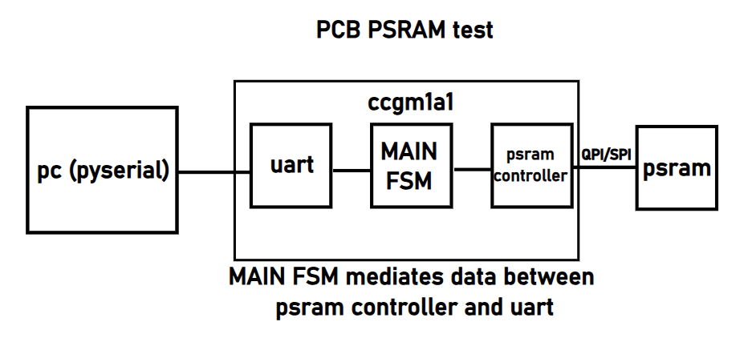

# PSRAM Controller Example
The goal of this design is to serve as a proven, fully-validated test of PSRAM and FPGA connectivity for PCB development. It is also a good starting point for any apps that need large data storage space.

## RTL Design
UART RX receives a list of bytes which represent a `Command` for the PSRAM Controller, with following structure:
- **Byte 0**: R/W select,  `0x0` - read,  `0x1` - write
- **Bytes 1-4**: 24-bit PSRAM address 
- **Bytes 5-6**: 16-bit data to write (optional)

The PSRAM Controller then forwards the command and returns a value if it is a read operation. Here is an example of these UART commands: 
- `0x0223344`     - read from address 0x223344
- `0x12233440708` - write to address 0x223344 data 0x0708

<p align="center">
  
</p>

## Sim steps
Change directory to the 2.sim:
```
cd 2.sim
```
Then following options are avaliable, all for **Verilator**:
- `make`            - to run RTL simulation
- `make all_synth`  - to run post-synthesis simulation
- `make all_impl`   - to run post-PnR simulation

**iverilog** simulator is also supported:
- `make vlog_sim`   - RTL sim
- `make synth_sim`  - post-synthesis simulation
- `make impl_sim`   - post-PnR simulation

Also provided are `make wave`, `make wave_iverilog` and `make clean`, `make clean_iverilog` targets which open the waveform viewer and delete all sim output files.

## Build steps
To implement and load design into FPGA:
```
cd 3.build
make hw_all
```

## Demo on actual hardware
Having built and loaded this example, to see it in action, run the python script under `4.testing`. It will automatically randomize the addresses and data to be written and read, then compare the values.
```
cd 4.testing
python3 pyauto.py
```

**Interesting quirks**:
- Second `sent` output port is needed for the _uart_tx_ to function properly. The corresponding capacitive load increase might be what is helping GateMate deliver
- On-board RPi USB-UART bridge is senisitive to timing precision. We therefore must use settings with no more than 0.2us timing error

#### End of Document
