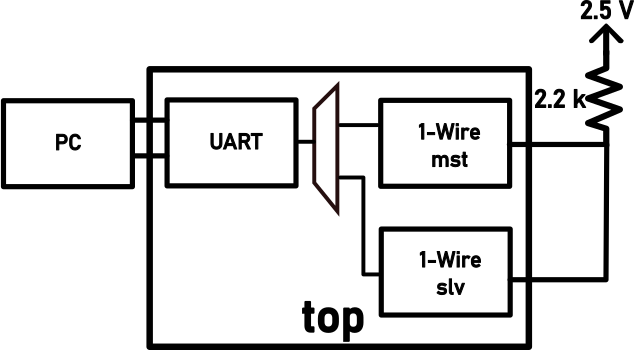
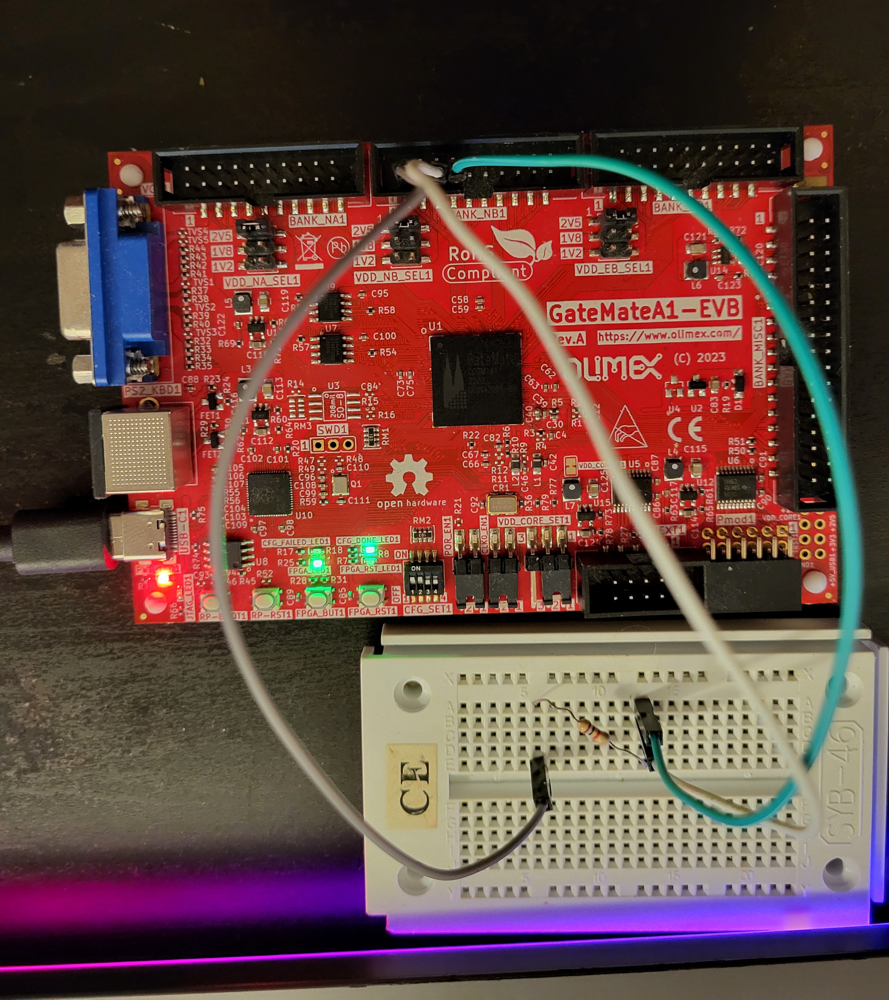

# openCologne
## * WORK IN PROGRESS * UNDER CONSTRUCTION *
> WHILE THIS NOTICE IS PRESENT, DON'T EXPECT DESIGN, SIM, OR ANY OTHER FILE IN HERE 2BE DOIN' WHAT IT'S SAYIN'

Due to the CologneChips GateMate having a scarce number of GPIO pins, here is provided and tested a 1-Wire controller, plug-and-play into a ready-valid SoC bus. 
## The Design
Provided 1-Wire master controller is based on the jeras' [implementation](https://github.com/jeras/sockit_owm), supporting single slave configuration, doing it barebones, as opposed to a full 1-Wire slave bus with custom 64-bit ROM codes. This simplification is justified by the intended use case of this 1-Wire controller: usually interfacing with a single sensor. 

Key features and parameters that the design offers:

1. Standard 1-Wire communication speed of 16.3 kbit/s (OVD_E =0)
2. Overdrive 1-Wire communication speed of 125 kbit/s (OVD_E = 1)
3. Clock divider precision (`BTP_N` and `BTP_O` - optimizing logic size with the price of precision)

The testing platform is a single FPGA, hosting both the 1-Wire master device and the 1-Wire slave device. Slave and master module are wrapped together in a top module which includes an UART. Top module purpose is solely testing and demonstrating the operations of the 1-Wire Master and Slave modules on Cologne Chips GateMate FPGA. 

To test both sending and receiving functionality in master and slave modules the top module is set to be modified slightly. Set up in the figure below represents the full test suite functionality. 



Below are instructions on pre-build modifications in order to test both 1-Wire master controller sending and receiving functions. In essence, you change what the UART sends to the PC (either "`master_rdat`" or "`slave_rdat`")
1. Testing Master sending:
```
   onewire_slave_model #(
      .WRITE_E(0)         // 0-reading  1-writing
      ...
```
```
   assign uart_tx_data  = slv_written_data;// writing to the 1-Wire slave
   assign uart_tx_write = slv_wrote;
   ...
   onewire_we   = 1'b1;                    // 0-reading  1-writing
```
2. Testing Master receving:
```
   onewire_slave_model #(
      .WRITE_E(1)         // 0-reading  1-writing
   ...
```
```
   assign uart_tx_data  = onewire_rdat;   // reading from the 1-Wire slave
   assign uart_tx_write = onewire_read;
   ...
   onewire_we   = 1'b0;                    // 0-reading  1-writing
```
## Build steps
To get the design synthesized, run PnR and upload the design:
```
cd 3.build
make hw_all
```
As onewire is in an open-drain pull up configuration, external pull up voltage and resistance to the io pins is required. In this example IO_NB pin header (see 1.hw/constraints/constraints.ccf for more details) is used to tie the `onewire_mst` and `onewire_slv` pins together with a 2.5 [V] pullup voltage and a 2.2k resistor, as in the system schematic shown above. 


After that, by observing the serial port on baud rate 115200 you should see that the character 'A' is being received repeatedly.
## Simulation steps
Change directory to the 2.sim:
```
cd 2.sim
```
Then the following options are avaliable, all run in **Verilator**:
- `make`  to run RTL simulation
- `make all_synth` to run post-synthesis simulation
- `make all_impl` to run post-PnR simulation

**iverilog** is too supported as a simulator:
- `make vlog_sim` - RTL sim
- `make synth_sim`- post-synthesis simulation
- `make impl_sim`- post-PnR simulation

Also provided are `make wave`, `make wave_iverilog` and `make clean`, `make clean_iverilog` targets which run the waveform viewer and clean the output files of simulation runs.
T
**<h3>  End of Document </h3>** 


[def]: drawing.svg