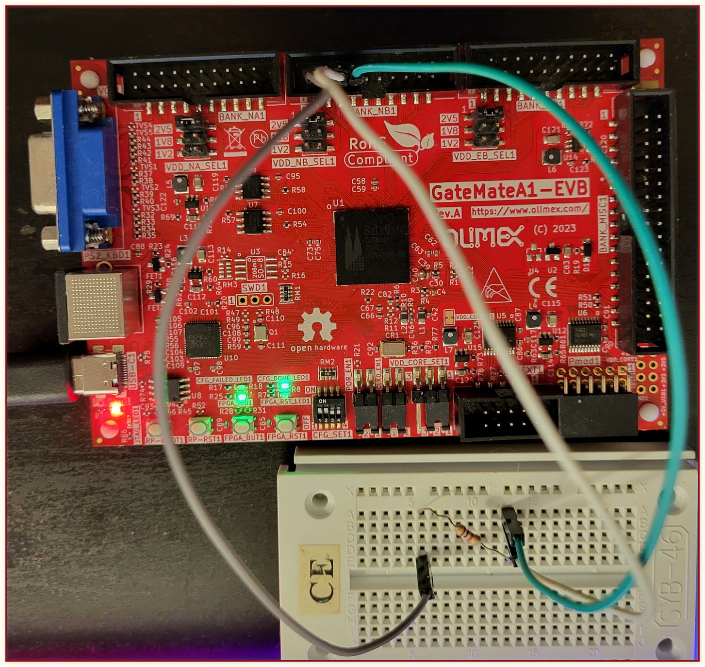

# 1-Wire Controller as eduSOC peripheral

In order to make up for GateMate relatively low pin counts, i.e. its general shortage of I/O resources, we are providing a simple OneWire Controller. This one is fully-tested and plug-and-play compatible with our standard `RDY/VLD` SoC bus. 

## RTL Design
This 1-Wire port to CologneChip GateMate is based on @jeras open-source [design](https://github.com/jeras/sockit_owm). It supports only one attached slave, as opposed to a full 1-Wire peripheral bus with custom 64-bit ROM codes. This simplification is justified by its intended use case, which is to allow interface to a single sensor. 

Key features and parameters of this peripheral core are:

1. Standard 1-Wire communication speed of `16.3 kbit/s` (OVD_E = 0)
2. Overdrive 1-Wire communication speed of `125 kbit/s` (OVD_E = 1)
3. Clock divider precision: `BTP_N` and `BTP_O` - for tradeoffs between precisiona and logic size

The testing platform is a single FPGA, hosting both 1-Wire Master and 1-Wire Slave. The Master and Slave are wrapped together in a Top module that also includes an UART. The purpose of Top module is to test and demonstrate the operations of 1-Wire Master and Slave on the Cologne Chips GateMate silicon. 

Figure below represents the full test setup. 

>

## Test Scenarios

You ought to slightly modify the top module in order to test both directions. In essence, you change what the UART sends to the PC (either "`master_rdat`" or "`slave_rdat`")

### Test1. Master sending:
```
onewire_slave_model #(
   .WRITE_E(0)          // 0-reading; 1-writing
   ...
```
```
assign uart_tx_data  = slv_written_data; // writing to the 1-Wire slave
assign uart_tx_write = slv_wrote;
   ...
onewire_we   = 1'b1;  // 0-reading; 1-writing
```

### Test2. Master receiving:
```
onewire_slave_model #(
   .WRITE_E(1)        // 0-reading;  1-writing
   ...
```
```
assign uart_tx_data  = onewire_rdat;   // reading from the 1-Wire slave
assign uart_tx_write = onewire_read;
   ...
onewire_we   = 1'b0;                   // 0-reading; 1-writing
```

## Sim steps

Change directory to the `2.sim`:
```
cd 2.sim
```
Then the following options are avaliable, all run in **Verilator**:
- `make`            - run RTL simulation
- `make all_synth`  - run post-synthesis simulation
- `make all_impl`   - run post-PnR simulation

**iverilog** is also supported as a simulator:
- `make vlog_sim`  - RTL sim
- `make synth_sim` - post-synthesis simulation
- `make impl_sim`  - post-PnR simulation

Also provided are `make wave`, `make wave_iverilog` and `make clean`, `make clean_iverilog` targets. They open the waveform viewer and delete all output files.

## Build steps

To get the design through all build steps (synthesis, PnR, then download the bitfile):
```
cd 3.build
make hw_all
```

## Demo on actual hardware

As OneWire is an open-drain bus, an external pull-up resistor must be added to the IO pins. We are using IO_NB pin header (see _1.hw/constraints/constraints.ccf_ for more details) for this example. There, please connect `onewire_mst` and `onewire_slv` pins together, and also add a 2.2K pullup resistor to 2.5V supply. Then observe the serial port (8-bit Data, no Parity, 1-bit Stop, Baud rate 115200), where character 'A' should be received repeatedly.

>

### End of Document
