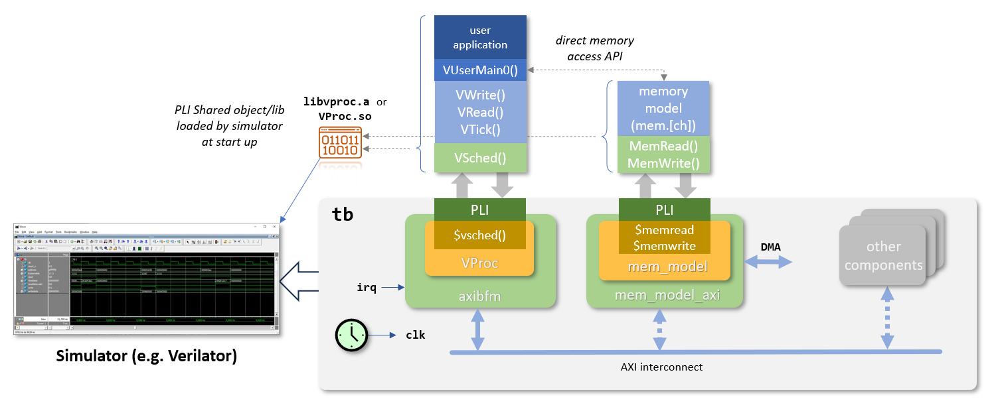
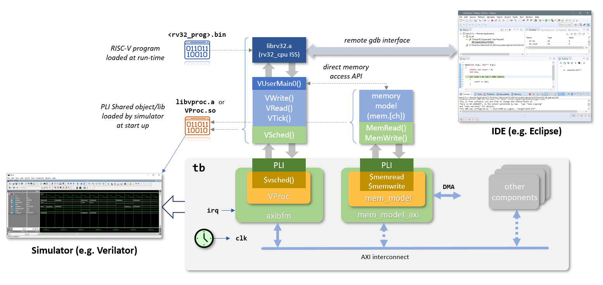
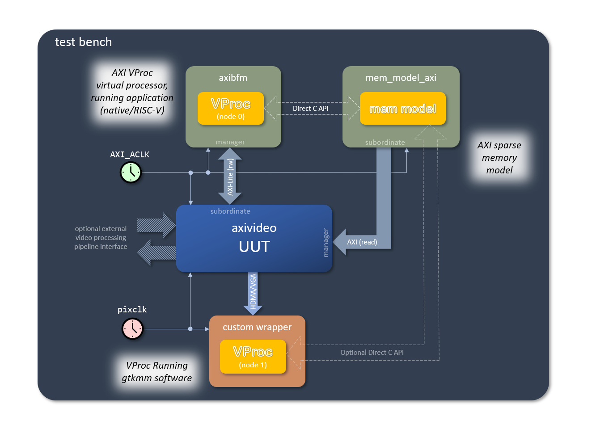

# HW/SW co-sim with VProc VIP
by Simon Southwell

## First things first
- [Vproc Intro](https://drive.google.com/file/d/1V81Q9Ue9HjQIpum2KXUp8eKwzed-kwfm)
- [VProc Manual](https://github.com/wyvernSemi/vproc/blob/master/doc/VProc.pdf)

## Native Mode

## ISS Mode

## Testbench structure

## How to build and run it

## Misc Tidbits: VProc Node
Node is simply memory mapped in _display.v_ for cross referencing. When using the C API or when creating a new C++ API object, the node number must be used to connect to a given VProc instantiation which might, accidently, be the wrong one. This simply gives a means, if desired, to check that the API object is connected to the expected node for safety and avoiding unexpected behaviour. It does not have to be there for VProc to work.

## Misc Tidbits: VProc Delta-Cycle Processing
The "delta-cycle" process can't be a clock in order to access more than 32 bits  to read and/or update in a single cycle. Conceivably if one needed to access, say, ten 32-bit ports, then VProc could be run 10 times faster to update by the end of the external clock, but this is an arbitrary number and might not work for all possible cases. 

It would likely run slower than using the delta-cycle updates. It's only needed, in any case, if using VProc to memory map ports---and the jury is out for _display.v_ and I need to measure its impact on performance. 

The whole delta cycle logic can be disabled by setting VProc's **DISABLE_DELTA** generic to non-zero, and the **Update** and **UpdateResponse** signals are then unconnected. In a test bench that only has VProcs used as a 32-bit memory mapped virtual CPUs, then this feature can be ignored and configured out. 

Delta cycle accesses are used for pcievhost, but it might conceivably be configured out for a single lane 8b10b bit in and out port (20 bits) and a electrical idle in and out, but two lanes or more is not possible as this will require multiple accesses per cycle.

## References
- [LI-2024-01](https://www.linkedin.com/pulse/vproc-virtual-processor-vip-simon-southwell-pjmpe)
- [LI-2024-10](https://www.linkedin.com/posts/simon-southwell-7684482_riscv-iss-embeddedsoftware-activity-7256311551178027008-1nlZ?utm_source=share&utm_medium=member_desktop)
- [VGASIM](https://github.com/wyvernSemi/vgasim)

#### End of Document
