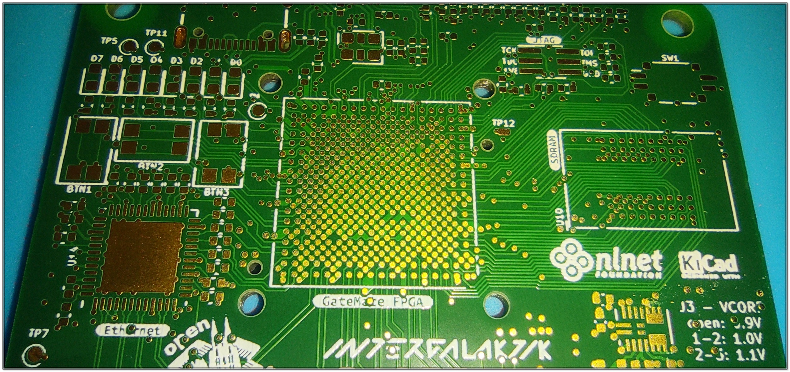
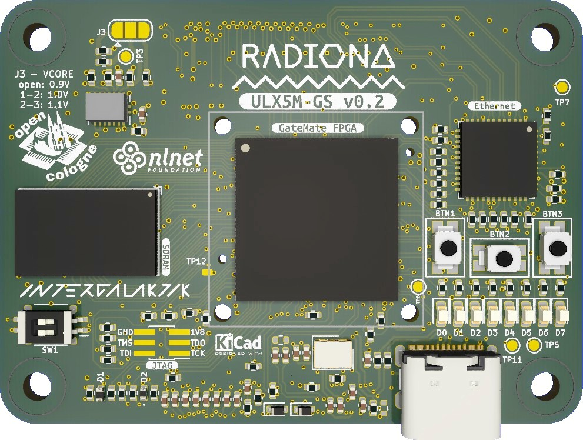
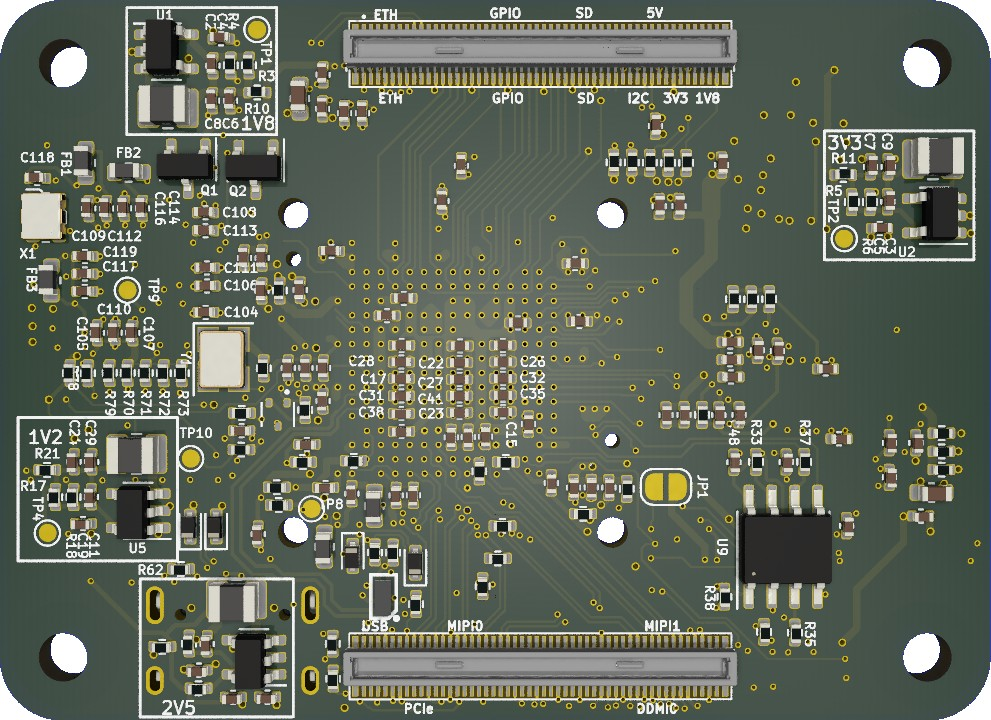
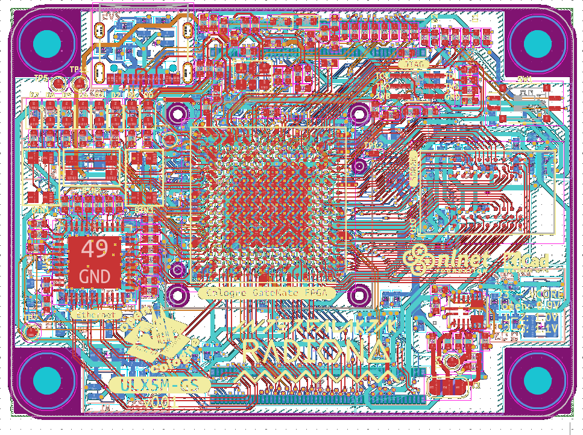
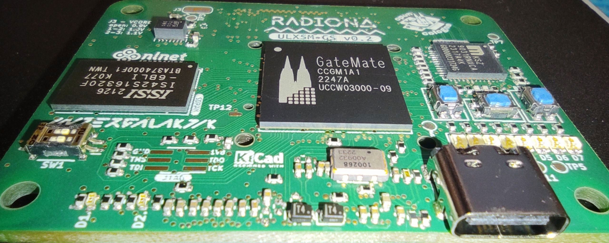
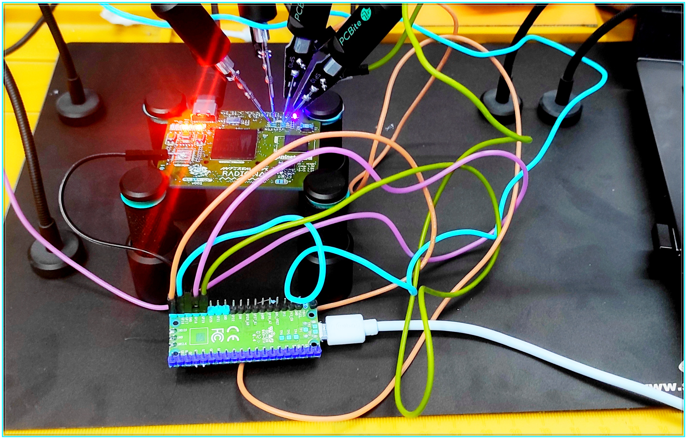
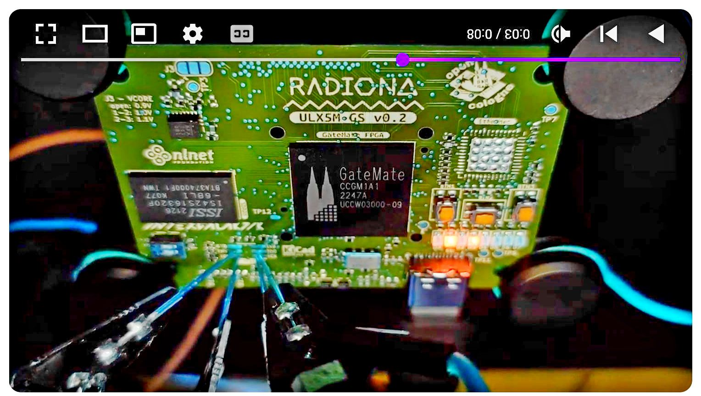
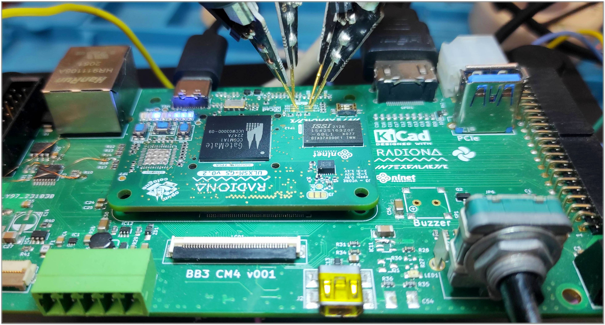

# PCB2 - Advanced (ULX5M-GS)

For more, please see:
- [Extension_Boards_for_Olimex_GateMate repo](https://github.com/intergalaktik/ulx5m-gs)
- [PCB Request Issues](https://github.com/chili-chips-ba/openCologne/issues?q=label%3A%22PCB+request%22+)

### Conceptual design

   
   

### Manufactured prototypes

   
   
   
   
   

### Bringup/Debug

   

### Mounted on the CM4-BB3 carrier card

   

#### End of Document
