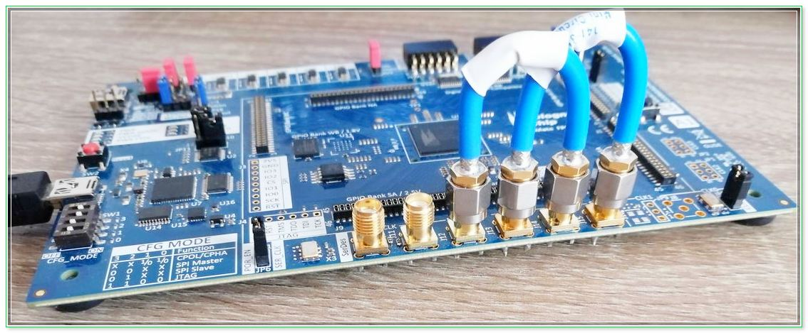

# SerDes App for GateMate

## Verifying board setup

Using the provided serdestool we can verify that our board setup is functioning correctrly. We can run a loopback test ( `./sedestool --tcloopback `) :

```
    INFO:  Found 1 device in JTAG chain.
    INFO:  Starting SerDes loopback testcases
    
    INFO:  Enabling TX PMA Loopback (Mode 0)
    INFO:  Configuring SerDes ADPLL
    INFO:  SerDes ADPLL frequency / data rate is 625.0 MHz / 1250.0 Mbit/s
    INFO:  Disabling SerDes ADPLL
    INFO:  Writing SerDes ADPLL divider settings
    INFO:  Stopping SerDes ADPLL self-calibration
    INFO:  Starting SerDes ADPLL
    INFO:  Starting SerDes ADPLL self-calibration
    INFO:  SerDes ADPLL locked
    INFO:  PFDAC result: max reached: 0, ac_result:  98320, CP:  3
    INFO:  ADPLL status: LCK: 1 FTO: 0 FTU: 0 FT:  708 SY:   0 ST: 2
    INFO:  Resetting SerDes TX
    INFO:  Resetting SerDes RX
    INFO:  Sending data (this might take a while) ...
    INFO:  Checking 32-Bit comma alignment
    INFO:  Resetting SerDes TX
    INFO:  Resetting SerDes RX
    INFO:  Sending data (this might take a while) ...
    INFO:  Checking 16-Bit comma alignment
    INFO:  Resetting SerDes TX
    INFO:  Resetting SerDes RX
    INFO:  Sending data (this might take a while) ...
    INFO:  Checking 8-Bit comma alignment
    
    INFO:  Enabling TX PMA Loopback (Mode 1)
    INFO:  Configuring SerDes ADPLL
    INFO:  SerDes ADPLL frequency / data rate is 625.0 MHz / 1250.0 Mbit/s
    INFO:  Disabling SerDes ADPLL
    INFO:  Writing SerDes ADPLL divider settings
    INFO:  Stopping SerDes ADPLL self-calibration
    INFO:  Starting SerDes ADPLL
    INFO:  Starting SerDes ADPLL self-calibration
    INFO:  SerDes ADPLL locked
    INFO:  PFDAC result: max reached: 0, ac_result:     16, CP:  6
    INFO:  ADPLL status: LCK: 1 FTO: 0 FTU: 0 FT:  706 SY:   0 ST: 2
    INFO:  Resetting SerDes TX
    INFO:  Resetting SerDes RX
    INFO:  Sending data (this might take a while) ...
    INFO:  Checking 32-Bit comma alignment
    INFO:  Resetting SerDes TX
    INFO:  Resetting SerDes RX
    INFO:  Sending data (this might take a while) ...
    INFO:  Checking 16-Bit comma alignment
    INFO:  Resetting SerDes TX
    INFO:  Resetting SerDes RX
    INFO:  Sending data (this might take a while) ...
    INFO:  Checking 8-Bit comma alignment
    
    INFO:  Enabling TX PCS Loopback
    INFO:  Configuring SerDes ADPLL
    INFO:  SerDes ADPLL frequency / data rate is 625.0 MHz / 1250.0 Mbit/s
    INFO:  Disabling SerDes ADPLL
    INFO:  Writing SerDes ADPLL divider settings
    INFO:  Stopping SerDes ADPLL self-calibration
    INFO:  Starting SerDes ADPLL
    INFO:  Starting SerDes ADPLL self-calibration
    INFO:  SerDes ADPLL locked
    INFO:  PFDAC result: max reached: 0, ac_result:  98330, CP: 25
    INFO:  ADPLL status: LCK: 1 FTO: 0 FTU: 0 FT:  707 SY:   0 ST: 2
    INFO:  Resetting SerDes TX
    INFO:  Resetting SerDes RX
    INFO:  Sending data (this might take a while) ...
    INFO:  Checking 32-Bit comma alignment
    INFO:  Resetting SerDes TX
    INFO:  Resetting SerDes RX
    INFO:  Sending data (this might take a while) ...
    INFO:  Checking 16-Bit comma alignment
    INFO:  Resetting SerDes TX
    INFO:  Resetting SerDes RX
    INFO:  Sending data (this might take a while) ...
    INFO:  Checking 8-Bit comma alignment

``` 
as well as a PRBS test (`./serdestool --tcprbs`):


```
    INFO:  Found 1 device in JTAG chain.
    INFO:  Starting SerDes PRBS testcases
    INFO:  Configuring SerDes ADPLL
    INFO:  SerDes ADPLL frequency / data rate is 625.0 MHz / 1250.0 Mbit/s
    INFO:  Disabling SerDes ADPLL
    INFO:  Writing SerDes ADPLL divider settings
    INFO:  Stopping SerDes ADPLL self-calibration
    INFO:  Starting SerDes ADPLL
    INFO:  Starting SerDes ADPLL self-calibration
    INFO:  SerDes ADPLL locked
    INFO:  PFDAC result: max reached: 0, ac_result:     19, CP: 28
    INFO:  ADPLL status: LCK: 1 FTO: 0 FTU: 0 FT:  708 SY:   0 ST: 2
    INFO:  Resetting SerDes TX
    INFO:  Resetting SerDes RX
    INFO:  Setting up PRBS-7
    INFO:  Sending data (this might take a while) ...
    INFO:  0/10
    INFO:  1/10
    INFO:  2/10
    INFO:  3/10
    INFO:  4/10
    INFO:  5/10
    INFO:  6/10
    INFO:  7/10
    INFO:  8/10
    INFO:  9/10
    INFO:  RX_PRBS_LOCKED: 1, RX_PRBS_ERR_CNT: 0
    INFO:  Starting error injection
    INFO:  RX_PRBS_LOCKED: 1, RX_PRBS_ERR_CNT: 6
    INFO:  Setting up PRBS-15
    INFO:  Sending data (this might take a while) ...
    INFO:  0/10
    INFO:  1/10
    INFO:  2/10
    INFO:  3/10
    INFO:  4/10
    INFO:  5/10
    INFO:  6/10
    INFO:  7/10
    INFO:  8/10
    INFO:  9/10
    INFO:  RX_PRBS_LOCKED: 1, RX_PRBS_ERR_CNT: 0
    INFO:  Starting error injection
    INFO:  RX_PRBS_LOCKED: 1, RX_PRBS_ERR_CNT: 7
```

P and N signals of the TX and RX channel are connected as in the following image:

<p align="center" width="100%">
    
</p>


### End of Document
