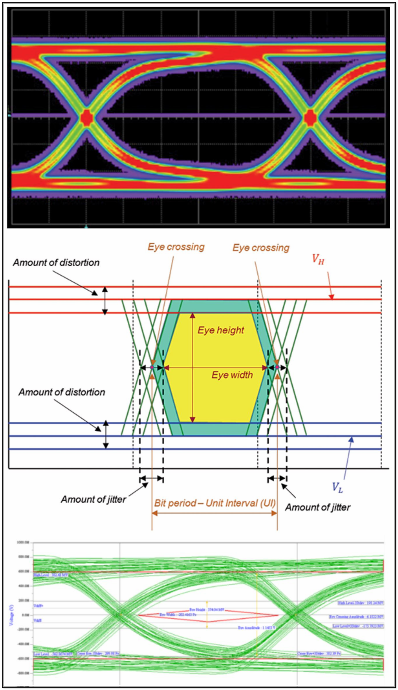

# SerDes App for GateMate

Design a high-speed serial, **memory-mapped Chip-to-Chip (C2C) Interconnect**. The goal of such IP is to set the stage for creating compute clusters and Hyper Cubes made of GateMate FPGAs, all physically interconnected with SerDes, with this C2C on top of it, serving as logical and transport layer.

## References:
- CologneChip [SerDes example design](https://github.com/pu-cc/gm_serdes_lb) and latest [datasheet](https://colognechip.com/docs/ds1001-gatemate1-datasheet-latest.pdf)
- Xilinx PG046 - [Aurora 8B/10B](https://docs.amd.com/r/en-US/pg046-aurora-8b10b/Introduction?tocId=Tqe8wtK9r1zAUq13hUnVEw)
    - Xilinx SP002 - [Aurora 8B/10B Protocol Spec](https://docs.amd.com/v/u/en-US/aurora_8b10b_protocol_spec_sp002)
- BerkeleyLab [ChitChat](https://berkeleylab.github.io/Bedrock/_gen_md/serial_io/chitchat/README_md.html) protocol
- LiteX [IC Link](https://github.com/enjoy-digital/liteiclink)
- [MesaBusProtocol](https://github.com/blackmesalabs/MesaBusProtocol)
- [Transputer](http://www.bitsavers.org/components/inmos/transputer/C011_Link_Adaptor.pdf)
- [LiteX 1000basex](https://github.com/pu-cc/liteeth/tree/gatemate1000basex)

- Timing-aware/better PNR for this high-speed design:
    - [Project Peppercorn](https://github.com/YosysHQ/prjpeppercorn)
    - [nextpnr for GateMate](https://github.com/YosysHQ/nextpnr/tree/gatemate)

- Primer on [Eye Diagrams](https://incompliancemag.com/eye-diagram-part1) and [Equivalent Time Sampling](https://www.tek.com/en/documents/application-note/real-time-versus-equivalent-time-sampling) (vs. real-time)

    

- Gowin primer on SerDes Signal Integrity ([SI](https://www.gowinsemi.com/en/market/market_detail/48)) measurements 

## Plan of Record
Having thoroughly studied all options, the developers presented them in a project meeting on _July 11, 2025_, where team unanimously decided for the GateMate Chip2Chip SerDes:
- not to mimic the semi-proprietary _Xilinx/AMD Aurora_
- not to be based on _BerkeleyLab ChitChat_ 
- not to be based on _MesaBusProtocol_
- not to invent _our own scheme_ (which was the original plan of Chili.CHIPS*ba developers)
- but rather to port `LiteX IC Link`, thus honoring CologneChip guidance and strong preference **<== WINNER!**

The _IC Link_ comes with a worked out interface to the CPU. Its interface to SerDes will leverage from Patrick's _1000basex Ethernet MAC_ project. The best part of the _IC Link_ is that it opens the full power of LiteX integration, making it available for CologneChip customers almosts instantly, and so with minimal coding burden. As such, the _IC Link_ is the Chip2Chip interconnect that CologneChip would benefit the most from for their SerDes. 

Given that GateMate proprietary (aka "legacy") PnR is rather unreliable and insensitive to timing constraints, while the new opensource PnR (Project Peppercorn) has already saved the day for our WP9-[BetrustedSOC](https://github.com/chili-chips-ba/openCologne/tree/main/9.BetrustedSOC), the _Chip2Chip SerDes_ will be delivered solely and exclusively for the _nextpnr_.

For details on the work completed so far and the planned next steps, please refer to the [4.liteiclink](https://github.com/chili-chips-ba/openCologne/tree/main/7.SerDes/4.liteiclink) section of the repository.

## Implementation
We strongly recommend to start with standalone [SerDes loopback test](1.serdestool_by_gm/README.md) to get used to the hardware platform, SerDes settings, cabling and work with RF-class signaling in general. 

Then move onto our [Lite IC Link](2.liteiclink/README.md) port for GateMate SerDes. You will find more detail in the respective project folders.

### Public Announcements
- [2025-02-21](https://www.linkedin.com/posts/patrick-urban-086177251_gatemate-fpga-colognechip-activity-7298662301677551616-4sw0?utm_source=share&utm_medium=member_desktop&rcm=ACoAAAJv-TcBSi_5ff0VNMrInrT-xg44YF3jnyU)

### End of Document
