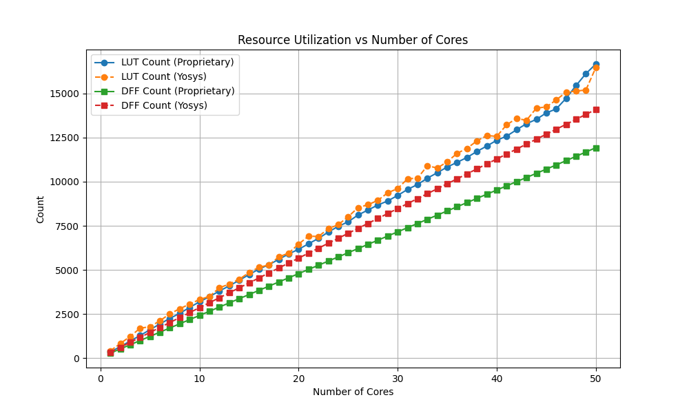
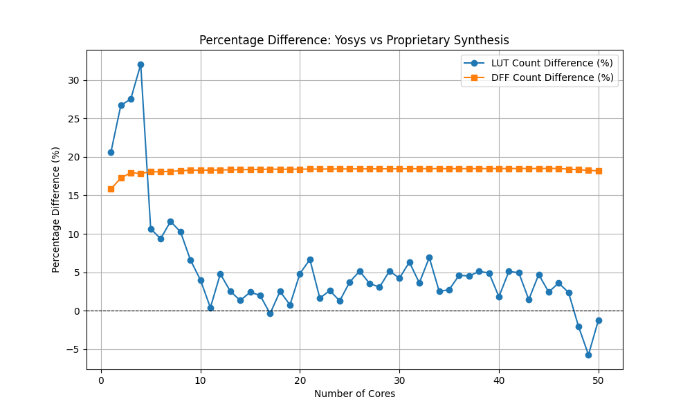

# CORESCORE - how many Servs can a FPGA serv?
## * WORK IN PROGRESS * UNDER CONSTRUCTION *
> WHILE THIS NOTICE IS PRESENT, DON'T EXPECT DESIGN, SIM, OR ANY OTHER FILE IN HERE 2BE DOIN' WHAT IT'S SAYIN'

This is a popular metric, determining FPGA's logic capacity, routing algortihm and architectural ability to use all of the FPGA. We were able to achieve **54** cores with Fmax of **22.93 MHz**, when using `-tm 3` PnR "worst" timing setting. For comparison GW2AR-18C C8/I7 (20K LUT4) implemented **50** cores at **58 MHz** for worst timing PnR settings, bare in mind that this is a higher speed grade chip **C8/I7**.  

## Results and analysis
### Tools disclosure
Obviously, comparing results obtained pushing the test sources through open-source yosys and propriatary synth isn't an apples to apples comparison. In an attempt to address this difference, and find the real potential of the GateMate's architecture, we conducted a reference yosys benchmark. Results of yosys synthesis are then compared to the "golden standard" propriatary syntehsis tool (Gowin). Later, all results can potentially be adjusted to account for the defficiencies in yosys. We didn't test the PnR tools since usually there are no alternatives. 
Through testing, we obtained utilization figures for `1 <= core_count <= 50` for the **Gowin GW2AR-18C FPGA (20k LUT4)**. 

Graphs are indicating a melting lead of propriatary tools, especially percentage-wise, but they still remain superior. The number of DFFs though, is steadily favoring the propriatary synthesis. Coming to an understanding of these results is possible only when we consider also the number of LUTRAM elements used in both implementations. Proprietary synthesis tools optimize resource usage by leveraging LUTRAM, reducing DFF consumption at the cost of additional LUTs. In contrast, Yosys relies on a basic approach using DFFs and LUTs exclusively. This results in higher LUT and DFF utilization in Yosys, as it emulates LUTRAM behavior with standard logic elements. The number of block RAMs remains unchanged and is therefore not shown. In relative perspective, yosys is far worse off for small designs, but the playing field evens out at higher utilization numbers. 

### Takeaway - not so obvious
Propriatary Gowin PnR topped out at 50 cores, utilizing only <td>11930 / 15750</td> of avaliable DFFs before reporting "fail to place 64 REGs". Taking this into account, yosys-based design would fail at 41 cores, or even earlier since the LUT usage is also increased. 

Here we face a tough decision, **how to take yosys into account?** On one hand it's just 5% more LUTs and 18% more DFFs, but on the other hand it's prone to failing PnR with 20% less total logic instatiated. Since we're dealing with GateMate in our analysis, whose PnR isn't directly yosys netlist [compatible](https://github.com/chili-chips-ba/openCologne/issues/28#issuecomment-2353907213), from now on we use a 25% correction when assessing results. That would bring 41 yosys cores to 50 propriatary in Gowin.



### Test results
These tests have been verified on the real system.
```
Utilization Report

 CPEs                  20037 /  20480  ( 97.8 %)
 -----------------------------------------------
   CPE Registers       13921 /  40960  ( 34.0 %)
     Flip-flops        13921
     Latches               0

 GPIOs                     3 /    144  (  2.1 %)
 -----------------------------------------------
   Single-ended            3 /    144  (  2.1 %)
     IBF                   2
     OBF                   1
     TOBF                  0
     IOBF                  0


 Block RAMs             26.0 /     32  ( 81.3 %)
 -----------------------------------------------
   BRAM_20K                1 /     64  (  1.6 %)
   BRAM_40K               25 /     32  ( 78.1 %)
   FIFO_40K                0 /     32  (  0.0 %)

 PLLs                      1 /      4  ( 25.0 %)
 GLBs                      1 /      4  ( 25.0 %)
 SerDes                    0 /      1  (  0.0 %)
```

Considering that only 34% of sequential logic is utilized, but all Cologne Programmable Elements (CPEs) are fully utilized, it can be concluded that nearly all combinatorial elements are consumed. This positions the 20.5k CPE CologneChip GateMate FPGA alongside other FPGAs with similar capacities. 


Notably, the GateMate's architecture, with 20.5k CPEs, effectively provides 41k LUT4 equivalents, as each CPE comprises an 8-input LUT-tree, which can be configured as two 4-input L2T4 primitives. Due to the reduced number of configuration bits required by this architecture, we can compute the normalized metric of **configuration bits per core** (the lower, the better). Throughput is computed by this formula: `core_count/technology`

| FPGA Model         | Core Count | Configuration Bits per Core | LUT4 Count | Technology | Throughput |
|--------------------|-----------|-----------------------------|------------|------------|-------------|
| 10CL025YU256C8G   | 60        | 6666                        | 25k          | LP 20nm    | 3        |
| CCGM1A1-BGA324    | 54        | 9102                        | 41k        | LP 28nm    |    1.964     |
| LFE5U-25F-6BG256C | 61        | 7069                        | 24.3k      | LP 40nm    | 1.525        |
| EP4CE10F17I7N     | 54        | 5770                        | 22k       | 60nm       | 0.9        |
| GW2AR-18C C8/I7   | 50        | 6635                        | 20.7k       | 55nm HS | 0.9         |


This indicates that the CCGM1A1 has a lower effective logic density per area unit, as measured by configuration bits per core. Conversely, CCGM1A1 shines in throughput per dollar, holding strong against the competition.

## Build steps
Put Yosys and GateMate p_r in PATH, and make sure you have FuseSoC installed:
```
pip install fusesoc
```
Navigate to 1.corescore_cc
```
cd 8.StressTest/1.corescore_cc/
```
Build FuseSoC target cc_gatemate
```
fusesoc run --target=cc_gatemate corescore
```

At this point your design should've successfully generated a bitstream. Uploading the bitstream to your board:
```
cd 8.StressTest/1.corescore_cc/
make program
```
Listen to serial port at **57600 baud rate 8b no parity, 1 stop bit**, your output should be something like this, with xx ranging from `00` to `number_of_cores-1`:
```
core xx says hello
```

If for any reason you want to change the number of cores instantated, simply go to `fusesoc_libraries/corescore/corescore.core`, under targets find `cc_gatemate`, and change the count in the following line to a desired number of cores
```
generate: [corescorecore: {count: 55}]
```
**RTL functional simulation**:
If for any reason you need debugging, there's a `sim` target provided, requiring Verilator. Waveform visualisation is left to the user.

