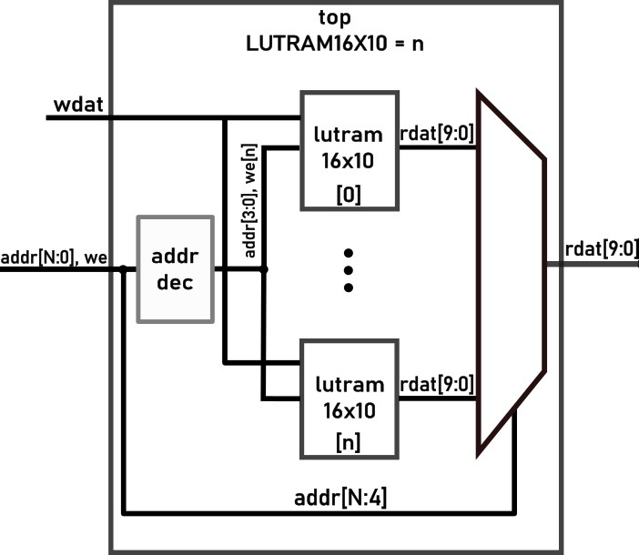

# LUTRAM_Stress_Test - FPGA's distributed memory capacity 
## * WORK IN PROGRESS * UNDER CONSTRUCTION *
> WHILE THIS NOTICE IS PRESENT, DON'T EXPECT DESIGN, SIM, OR ANY OTHER FILE IN HERE 2BE DOIN' WHAT IT'S SAYIN'

An interesting twist on the CCGM1A1 is that there are no distributed memory primitives provided. This is due to multiple reasons, one being the required added complexity for decoding logic since LUT trees are used in place of classic LUTs. Instead, GateMate emulates distributed memory with flip-flops and a few muxes. Hereby we present a test for FPGAs distributed RAM capacity, expecting to examine GateMates lack of integrated LUTRAM. 

The primary motivation for examining this benchmark arises when evaluating the **portability** of other designs, as various porting attempts are likely. If the FPGA struggles to emulate a substantial amount of distributed RAM, switching to Block RAM necessitates **retiming** the entire design, which is an inconvenience.

## Testing strategy
16x10 distributed RAM is generated in a loop, specifically so the number of outputs and inputs stays the same from the top level module, employing an output read mux, and input address decoder. This test is design to assess the LUTRAM capabilites of the different FPGA vendors, coupled with their own propriatary tools, using a generic test which hides away the vendor-specific primitives.



## Results and analysis
### Gowin GW2AR-18C - 255 modules
Tool settings: `Placer-1 priority to routability, Router-0 default, max fanout 23`

Synthesis maximum numbers:

    - 314 modules instantiated
    - Logic elements 15058/20736
        - 11170 LUT
        - 648 RAM16S4 SSRAM
    - 15680/15750 DFF
    Error: Failed to place 10767 REG(s)

PnR included maximum numbers:

    - 255 modules instantiated
    - Logic elements 10346/20736
        - 6458 LUT
        - 648 RAM16S4 SSRAM
    - 8000/15750 DFF
    Error: Failed to place 145 REG(s)


### CologneChip CCGM1A1 - 24 modules
Tool settings: `om-3 (speed), tm-3(worst timing, best routability)`

Synthesis only maximum numbers: N/A because the number of primitives used obtained by synhtesis isn't easily mappable to the final number of CPEs used which is known only after PnR. 

<!-- Synthesis maximum numbers:
    - 100 modules instantiated
    - Logic elements 15058/20480
        - 11170 LUT
        - 648 RAM16S4 SSRAM
    - 15680/15750 DFF
Error: Failed to place 10767 REG(s) -->

PnR included maximum numbers:

    - 24 modules instantiated
    - Logic elements 2255/20480
    - 1600/15750 DFF
    FATAL ERROR: CPE_OUTMUX congestion at Component 333 with 353

### Conclusion
With only 24 modules instantiated before routing fails, the CCGM1A1 is severely underperforming for its weight class. For context, an 18k LUT4 Gowin FPGA would offer roughly ten times the capacity—even though the device in question seemingly has more resources. Moreover, these 24 modules only amount to 3,840 bits (480 bytes). This implies that even small distributed memories might need to be migrated to block RAMs and the design re-timed.

It’s important to note that these results do not yet clearly define the boundaries of what’s plausible. One key variable remains: **Why did place-and-route (PnR) fail?** As indicated by the utilization figures, the CCGM1A1 is extremely underutilized, failing at just 10% of the available DFFs. This suggests that the issue lies not with the memory resources, but with limitations imposed by the routing tools and architecture.

Another concern arises: if a 250-input multiplexer fails during routing, what does that say about our place-and-route tools and routing architecture? Notably, a 250-input mux is common in CPU designs for handling write-backs, also consider that a complete 32x32 register file requires a 1024-input mux!

Since this test hit a wall, we conducted a similar, yet less routing-constrained more memory-oriented [test](https://github.com/chili-chips-ba/openCologne/tree/main/8.StressTest/3.LUTRAM_adjusted_stress_test). We chose to include this test despite it not fully addressing the distributed memory capacity. It serves instead as a case illustrating the limitations of the toolchain and architecture.


## Reproduction steps
### Prerequsites
Gowin and CologneChip propriatary toolchains for Synthesis and Place and Route. Optionally, for simulation and verifying Verilator + GtkWave.
### Build steps
The top module provides a parameter `LUTRAM16X10` which is to set the number of 16x10 modules instantiated in the design. Once set, to run the GateMate toolchain run the following commands:
```
cd 3.build
make hw_all
```
Afterwards, check the `3.build/log/impl.log` for the number of CPE used or the exact error provided. Gowin propriatary toolchain is provided in GUI form only, start the project, run synhtesis and PnR, and check the Synhtesis report. 

If for any reason you want to simulate the design run:
```
cd 2.sim
make
```
Post-synthesis and post-pnr sims are avaliable also in iverilog and verilator, check the makefile for further information.
