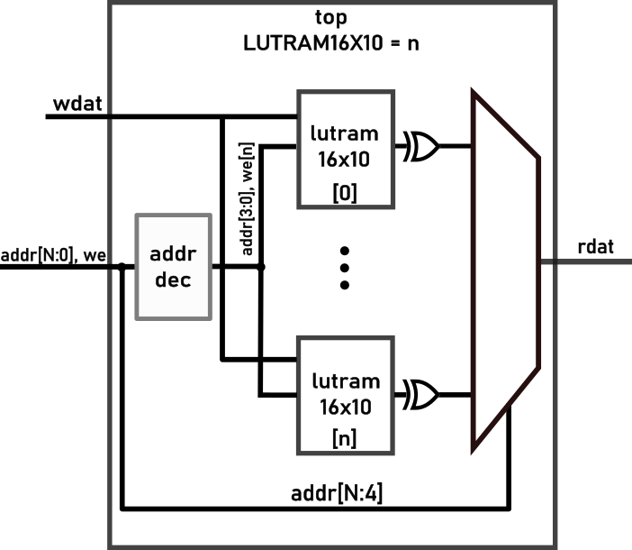

# LUTRAM_adjusted_stress_Test - FPGA's distributed memory capacity w/o heavy routing 
## * WORK IN PROGRESS * UNDER CONSTRUCTION *
> WHILE THIS NOTICE IS PRESENT, DON'T EXPECT DESIGN, SIM, OR ANY OTHER FILE IN HERE 2BE DOIN' WHAT IT'S SAYIN'

This test is a sequel to a previous test. It's highly recommended to review that test before proceeding. Unlike the original, this version reduces routing congestion by focusing solely on memory implementation. This approach isolates the internal memory performance from the effects of the router and architecture.
## Testing strategy
We eliminated the wide output multiplexer and concatenated the 10-bit outputs via an XOR gate at each LUTRAM output. Additionally, we removed the LSB address inputs in favor of a one-hot address encoding scheme. The resulting structure is illustrated in the figure below. This approach should significantly reduce routing congestion and enable testing of the maximum number of distributed RAM modules. However, despite these improvements, routing congestion errors may still occur due to the densely packed memory elements.

## Results and analysis

Despite the improvements, a routing error still occurs at 58% utilization. The test now fails at 55 LUTRAM instantiations, compared to 24 in the previous version increasing the distributed memory capacity by almost double. This indicates that while the bottleneck was reduced, it remains a critical issue. This experiment demonstrates that, under certain conditions, the CCGM1A1 architecture can support more LUTRAM than suggested by the original `LUTRAM_stress_test`, confirming that our routing constraints were correctly identified.

```
Utilization Report

 CPEs                  11921 /  20480  ( 58.2 %)
 -----------------------------------------------
   CPE Registers        8800 /  40960  ( 21.5 %)
     Flip-flops         8800
     Latches               0
```
