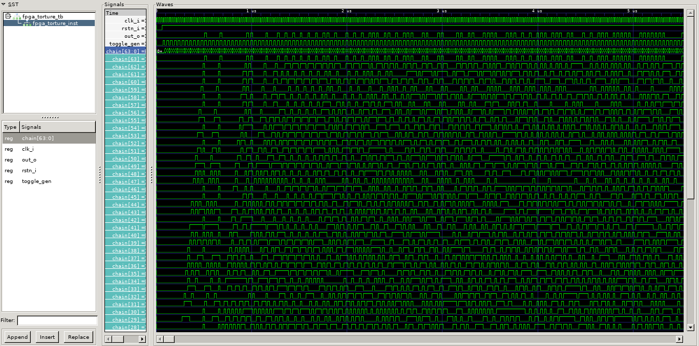

# fpga_torture_ - FPGA Stress-Testing

## * WORK IN PROGRESS * UNDER CONSTRUCTION * KNOWN ISSUES!!!!!!!
> WHILE THIS NOTICE IS PRESENT, DON'T EXPECT DESIGN, SIM, OR ANY OTHER FILE IN HERE 2BE DOIN' WHAT IT'S SAYIN'
## Testing strategy
For best comprehension of the hardware structure we're implementing here visit fpga_torture [repo](https://github.com/stnolting/fpga_torture). Here we'll just cover the basics and the implications regarding the stuff we're on lookout for which is primarily **routing congestion** and **logic capacity**.

This test implements a LUT3+FF chain through a Galois LFSR (Linear-feedback shift register). The LFSR takes 3 DFF outputs, implements a xor on them, and feeds it back to a DFF input. The structure is known to generate a seemingly "random-like" chaotic switching, dissipating maximum dynamic power. 




Now, how does this map to our task of assessing logic capacity and routing capability. Each element instantiated in the LFSR adds a LUT3 and a DFF, so it is a fine-grained structure, and the goal is to fit in as many elements as possible. Theoretically, since the L2T4 elements can do xors on 3 inputs, the limit is around 40k elements instantiated, but some limitations may reduce this number.

The large LSFR chain expresses a **short, local** routing challenge since the signal lines don't traverse more than 3 elements. From the logic capacity point of view, the LUT3s should directly map to L2T4 primitives.  


## Results and analysis
Successful instantiation of 28655 elements at 96.1% utilization is a noteworthy result. A surfacing trend is that the tools and the architecture perform well in short, local routing tasks. This may be a reflection of just the tools capabilities, which is to be verified, but the overall anaysis is laid out [here](https://github.com/chili-chips-ba/openCologne/tree/main/8.StressTest).

As far as the logic capacity goes, **28655 elements** were instantiated at **96.1%** CPE utilization, but the registers remain at 70%. This clearly points that once again we ran out of logic capacity and pushed the CPEs to the limit as in [1.corescore](https://github.com/chili-chips-ba/openCologne/tree/main/8.StressTest/1.corescore_cc). The GateMate outperformed comparable 20k LUT devices (which, of course, are limited to a maximum of 20k instantiated elements, assuming sufficient DFFs). However, it still fell short of the theoretical limit of 41k instantiated elements.

Overall, the number of DFFs appears to be oversized relative to the available logic elements, as even in predominantly sequential circuits, performance is constrained by the logic rather than flip-flops. For contrast, Gowin GW1NR-9C (C6/I5, 55nm, 9k LUT4 FPGA) can achieve only 6475 elements instantiated, limited by the number of it's DFFs. Based on this metric, GateMate's effective capacity is equivalent to a 28.6k LUT4 and DFF device.

Another important observation from this test is the Fmax assessment. The design's critical path consists of only a single LUT3, making for a most optimistic scenario for assessing Fmax. Here we encounter two distinct cases of results: the best and the worst, comparing CCGM1A1 (28nm LP process node) to Gowins GW1NR-9C (55nm LP process node):

| PnR Option             | CCGM1A1 (28nm LP) Fmax (MHz) | GW1NR-9C (55nm LP) Fmax (MHz) |
|------------------------|------------------------|---------------------------|
| `-tm 1` (Timing)       | 280                    | 170                       |
| `-tm 3` (Routability)  | 137                    | 121                       |

CCGM1A1 as expected beats the older 55nm GW1NR-9C, reaching a substantial 280 MHz. But more interesting is the big increase when prioritizing timing for CCGM1A1, referenced in this [issue](https://github.com/chili-chips-ba/openCologne/issues/62).


```
Utilization Report

 CPEs                  19689 /  20480  ( 96.1 %)
 -----------------------------------------------
   CPE Registers       28656 /  40960  ( 70.0 %)
     Flip-flops        28656
     Latches               0
```

Physical testing revealed that the FPGAs temperature was in the allowed range.

## Build steps
This test is written in VHDL as it is ported from the fpga_torture repository, therefore `ghdl` is a prerequisite. Yosys loads in the ghdl module when synthesizing, which is a crucial step and issues may arise if yosys is unable to find the ghdl plugin module. 
```
cd 3.build
make hw_all
```

