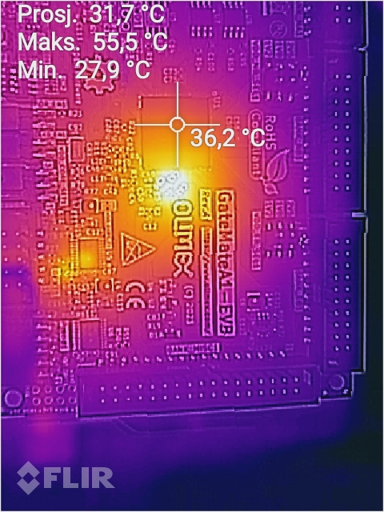

# fpga_torture_ - FPGA Stress-Testing

## * WORK IN PROGRESS * UNDER CONSTRUCTION * KNOWN ISSUES!!!!!!!
> WHILE THIS NOTICE IS PRESENT, DON'T EXPECT DESIGN, SIM, OR ANY OTHER FILE IN HERE 2BE DOIN' WHAT IT'S SAYIN'
## Testing strategy

## Results and analysis
Successful instantiation of 28655 elements at 96.1% utilization is a noteworthy result. A surfacing trend is that the tools and the architecture perform well in short, local routing tasks. This may be a reflection of just the tools capabilities, which is to be verified, but the overall anaysis is laid out [here](https://github.com/chili-chips-ba/openCologne/tree/main/8.StressTest).

```
Utilization Report

 CPEs                  19689 /  20480  ( 96.1 %)
 -----------------------------------------------
   CPE Registers       28656 /  40960  ( 70.0 %)
     Flip-flops        28656
     Latches               0
```

### Physical testing


28655 elements
## Build steps
This test is written in VHDL as it is ported from the fpga_torture repository, therefore `ghdl` is a prerequisite. Yosys loads in the ghdl module when synthesizing, which is a crucial step and issues may arise if yosys is unable to find the ghdl plugin module. 
```
cd 3.build
make hw_all
```

