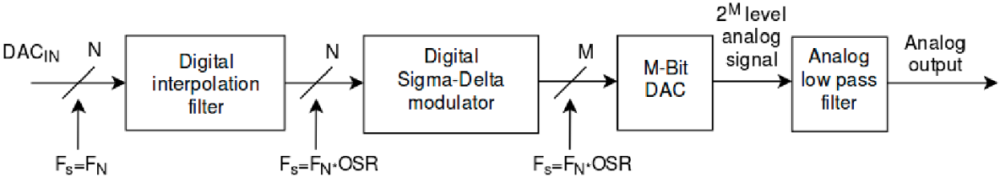
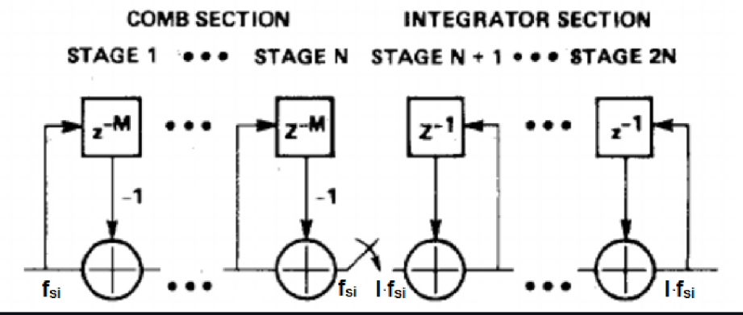

# Sigma-Delta Digital-to-Analog Converter — A DSP Case

This repository presents an implementation of a Sigma-Delta Digital-to-Analog Converter (DAC) on an FPGA, with a focus on evaluating logic utilization across different FPGA architectures. The design is based on the [Sigma-Delta-DAC](https://github.com/aimamovic6/Sigma-Delta-DAC) repository; please refer there for more details on the implementation.

We synthesized the RTL through the respective proprietary toolchains and obtained utilization results. The target comparison FPGA is the Gowin Arora GW2AR-18CQN88 I8/I7 (20k LUT4).

## Sigma-Delta DAC and GateMate Architecture

This test evaluates how well the GateMate platform handles DSP applications—a key area of interest. Note that **CCGM1A1 does not include any dedicated DSP hardware macros (DSP HMs)**, whereas the Gowin alternative does, which puts GateMate at a disadvantage from the start.

The Sigma-Delta DAC design is highly pipelined and features digital filtering and Sigma-Delta modulation—operations that are mathematically intensive. The CC CPEs are capable of performing standalone arithmetic, so we do not expect significant drawbacks in logic utilization. These CPEs can be configured to:
- Implement a 1-bit or 2-bit full adder, expandable to any length in horizontal or vertical arrangements.
- Function as a 2×2-bit multiplier, expandable to any multiplier size.

  

In this implementation, the digital interpolation filter used is a Cascaded Integrator-Comb (CIC) filter, which requires no multiplication and has limited storage requirements, as shown in the image below. Consequently, the design relies primarily on pipelining and addition. This scenario favors GateMate, since multiplication would typically be offloaded to HM macros in Gowin—but for this comparison, we are focusing solely on the logic resources.

## Logic Utilization in Sigma-Delta DAC Implementations

Contrary to expectations, the CCGM1A1 uses 33% more logic resources than the Gowin LUT4-based alternative—solely due to unavaliability of DSP HMs (which are automatically inffered from generic RTL). **However**, when we turn off DSP multipliers (which is not by default), the GateMate outscores traditional LUTs in arithmetic operations by quite some margin. The number of flip-flops is nearly identical between the two platforms.

>Gowin LUT and ALU are really both LUT, ALU is a Gowin primitive which utilizes LUTs to generate arithmetic logic. This ALU number serves as a metric of how much of the design is dedicated to "math" functionality. Even when utilizing HM DSPs, more than half of this design are math functions, confirming the initial assumptions about the SD-DAC test.

| **Resource Type**         | **GW2AR-18LVQN88 C8/I7 (defualt)** | **CCGM1A1**       |  **GW2AR-18LVQN88 C8/I7 w/o DSP HMs**| 
|---------------------------|-------------------------|-------------------|---------------------------------|
| **Logic (LUT / CPEs)**   | 2306(1127 LUT, 1179 ALU) | 3528 (CPEs)     | 	4828(1945 LUT, 2883 ALU) |
| **Registers (Flip-Flops)**     | 2230                   | 2238       | 2230 |
|**DSP HM (MULT36x36)**       | 3                       | N/A             | 0 |
|    **DSP HM MULTALU36X18**|1 | N/A|0|

LUT-trees score a clear win over traditional LUTs in math functionality. Unfortunately, putting things into perspective we need to account for the number of configuration bits needed to implement this circuitry as a metric of used up area on chip. The LUT-tree structure of a CPE takes up 28 configuration bits, while a single LUT4 takes up 16 configuration bits. Doing some basic math, this ends up to be `3528*28 = 98784` configuration bits for CCGM1A1, and `4828*16=77248` configuration bits for GW2AR-18C. 

This analysis highlights the DSP macro role, scoring an absolute win in this test. Even in apples to apples comparison of logic capacity, LUT vs LUT-tree analysis favored LUTs in terms of total area.
## Fmax Comparison
CCGM1A1 in default tool settings outperforms GW2AR-18C w/o DSP HMs in terms of Fmax, but not by much. Again, overall win goes to GW2AR-18C when utilizing DSP HMs.
- **Gowin GW2AR-18C:**  
  - Clock44KHz: 174.6 MHz  
  - Main Clock:  70.2 MHz
- **Gowin GW2AR-18C w/o DSP:**  
  - Clock44KHz: 169.1 MHz  
  - Main Clock:  16.1 MHz
- **CCGM1A1 (GateMate):**  
  - Clock44KHz: 68.43 MHz  
  - Main Clock: 21.3 MHz

### Conclusion

Overall, lack of DSP HMs is hurting the CCGM1A1 capability in math applications, both in terms of logic capacity and Fmax. Even in highly pipelined structures featuring mostly basic arithmetic, LUT-tree logic struggles to match the efficiency of traditional LUT4 implementations. Fmax lacks behind a faster chip in an older technology node. CCGM1A1 didn't particularly excel in a predominantly math-based design. 