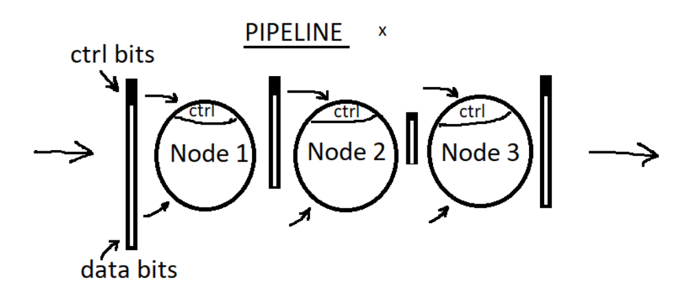
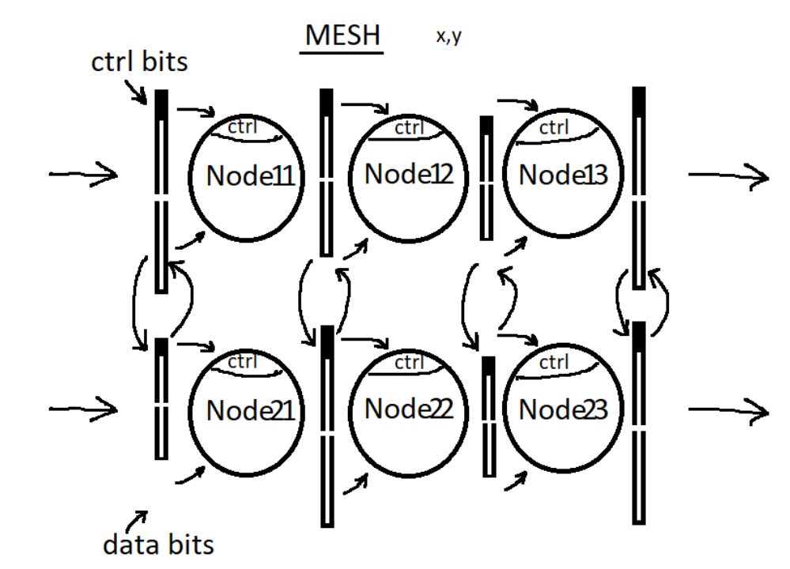
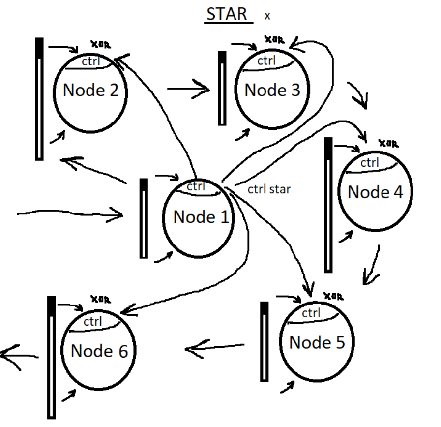

# PNR_TESTS

These tests were originaly written by Mike Reznikov and they can be found on the link: https://github.com/mirekez/pnr_tests

There are three different topologies implemented in pnr_tests, with the flexibility to add more. Each topology is composed of Nodes, where each Node implements a combinational logic function and currently contains no registers. An array of data is collected from random inputs, passed through the entire pipeline, and routed to random output pins. Additionally, a small random subset of data bits is designated as control signals and connected to both the logic function control inputs and flow control pins. Each Node randomly implements functions like MUX/DEMUX, QUEUE, MATH (MUL/DIV), ENCODER/DECODER, and possibly more.

## Pipeline
The simplest topology is a PIPELINE, a linear sequence of Nodes. Currently, registers between Nodes are inserted randomly, often resulting in very long chains. A small patch was added to enforce register insertion between Nodes, helping to shorten these chains.

 

## Mesh
The MESH topology consists of an X×Y two-dimensional array of Nodes. Signals are broadcast to all rows simultaneously. Neighboring row pairs randomly exchange portions of their data between corresponding Nodes, resulting in multiple diagonal data paths across the mesh.

 

## Star
The last topology, referred to as STAR, closely resembles the PIPELINE structure but differs in that control signals from the first Node are distributed to all other Nodes. This results in random high fanout during data processing. Integrating multiple topologies within a single design is beneficial and not difficult to implement.

 

## Test results (WIP)
The tables below show the results of our comparison between the GateMate CCGM1A1 and Gowin's GW2AR-18 LQ176.

### Mesh test results

|          **GateMate**        |**CCGM1A1**|          **Gowin**     | **GW2AR-18LQ176** |  **Delta**   |
|------------------------------|----------|-----------------------------|------------|-----------------|
| Number of wires:             | 6269     | Number of wires:            | 20950      |       -14681    |
| Number of wire bits:         | 125333   | Number of wire bits:        | 36376      |       88957     |
| Number of public wires:      | 478      | Number of public wires:     | 20950      |       -20472    |
| Number of public wire bits:  | 12306    | Number of public wire bits: | 36376      |       -24070    |
| Number of ports:             | 8        | Number of ports:            | 8          |       0         |
| Number of port bits:         | 70       | Number of port bits:        | 70         |       0         | 
| Number of memories:          | 0        | Number of memories:         | 0          |       0         |
| Number of memory bits:       | 0        | Number of memory bits:      | 0          |       0         |
| Number of processes:         | 0        | Number of processes:        | 0          |       0         |
| Number of cells:             | 52092    | Number of cells:            | 14993      |       37099     |
| $scopeinfo:                  | 44       | $scopeinfo:                 | 44         |       0         |
| CC_ADDF:                     | 29525    | ALU:                        | 8974       |       /         |
| /                            | /        | DFFRE:                      | 45         |       /         |
| CC_BRAM_40K:                 | 5        | DFFE:                       | 116        |       /         |
| CC_BUFG:                     | 1        | DFFR:                       | 246        |       /         |
| CC_DFF:                      | 2419     | DFF:                        | 1771       |       648       |
| CC_IBUF:                     | 36       | IBUF:                       | 36         |       0         |
| CC_LUT1:                     | 18       | LUT1:                       | 359        |       -341      |
| CC_LUT2:                     | 1212     | LUT2:                       | 331        |       881       |
| CC_LUT3:                     | 10020    | LUT3:                       | 2084       |       7936      |
| CC_LUT4:                     | 8757     | LUT4:                       | 595        |       8162      |
| CC_MX4:                      | 8        | MUX2_LUT5:                  | 276        |       /         |
| CC_MX8:                      | 12       | RAM16SDP4:                  | 80         |       /         |
| CC_OBUF:                     | 34       | OBUF:                       | 34         |       0         |
| CC_MULT:                     | 1        | /                           | /          |       /         |

### Pipeline test results

|          **GateMate**        |**CCGM1A1**|        **Gowin**      |  **GW2AR-18LQ176**    |  **Delta** |
|------------------------------|----------|------------------------------|------------|-----------------|
| Number of wires:             | 9456     | Number of wires:             | 17635      |       -8179     |
| Number of wire bits:         | 169141   | Number of wire bits:         | 31424      |       137717    |
| Number of public wires:      | 316      | Number of public wires:      | 17635      |       -17319    |
| Number of public wire bits:  | 10918    | Number of public wire bits:  | 31424      |       -20506    |
| Number of ports:             | 8        | Number of ports:             | 8          |       0         |
| Number of port bits:         | 70       | Number of port bits:         | 70         |       0         |   
| Number of memories:          | 0        | Number of memories:          | 0          |       0         |
| Number of memory bits:       | 0        | Number of memory bits:       | 0          |       0         |
| Number of processes:         | 0        | Number of processes:         | 0          |       0         |
| Number of cells:             | 78479    | Number of cells:             | 11784      |       66695     |
| $scopeinfo:                  | 38       | $scopeinfo:                  | 38         |       0         |
| CC_ADDF:                     | 38200    | ALU:                         | 7755       |       /         |
| CC_BRAM_20K:                 | 4        | RAM16SDP4:                   | /          |       /         |
| CC_BRAM_40K:                 | 22       | DFFRE:                       | 195        |       /         |
| /                            | /        | DFFE:                        | /          |       /         |
| CC_BUFG:                     | 1        | DFFR:                        | 67         |       /         |
| CC_DFF:                      | 2037     | DFF:                         | 1378       |       659       |
| CC_IBUF:                     | 36       | IBUF:                        | 36         |       0         |
| CC_LUT1:                     | 7        | LUT1:                        | 158        |       -151      |
| CC_LUT2:                     | 6953     | LUT2:                        | 176        |       6777      |
| CC_LUT3:                     | 8123     | LUT3:                        | 1375       |       6748      |
| CC_LUT4:                     | 22988    | LUT4:                        | 471        |       22517     |
| CC_MX4:                      | 24       | MUX2_LUT5:                   | 53         |       /         |
| CC_MX8:                      | 12       | MUX2_LUT6                    | /          |       /         |
| CC_OBUF:                     | 34       | OBUF:                        | 34         |       0         |
| CC_MULT                      | /        | /                            | /          |       /         |

### Star test results

|          **GateMate**        |**CCGM1A1**|        **Gowin**      |  **GW2AR-18LQ176**    |  **Delta** |
|------------------------------|----------|------------------------------|------------|-----------------|
| Number of wires:             | 16709    | Number of wires:             | 29567      |       -12858    |
| Number of wire bits:         | 158573   | Number of wire bits:         | 72712      |       85861     |
| Number of public wires:      | 4877     | Number of public wires:      | 29567      |       -24690    |
| Number of public wire bits:  | 56513    | Number of public wire bits:  | 72712      |       -16199    |
| Number of ports:             | 8        | Number of ports:             | 8          |       0         |
| Number of port bits:         | 134      | Number of port bits:         | 134        |       0         |  
| Number of memories:          | 0        | Number of memories:          | 0          |       0         |
| Number of memory bits:       | 0        | Number of memory bits:       | 0          |       0         |
| Number of processes:         | 0        | Number of processes:         | 0          |       0         |
| Number of cells:             | 64732    | Number of cells:             | 25149      |       39583     |
| $scopeinfo:                  | 515      | $scopeinfo:                  | 515        |       0         |
| CC_ADDF:                     | 23490    | ALU:                         | 8528       |       /         |
| CC_BRAM_20K:                 | /        | RAM16SDP4:                   | 702        |       /         |
| /                            | /        | DFFRE:                       | 572        |       /         |
| /                            | /        | DFFE:                        | 796        |       /         |
| /                            | /        | DFFR:                        | 321        |       /         |
| CC_BUFG:                     | 1        | DFFS:                        | 46         |       /         |
| CC_DFF:                      | 15490    | DFF:                         | 3394       |       12096     |
| CC_IBUF:                     | 68       | IBUF:                        | 68         |       0         |
| CC_LUT1:                     | 147      | LUT1:                        | 1070       |       -923      |
| CC_LUT2:                     | 4006     | LUT2:                        | 3279       |       727       |
| CC_LUT3:                     | 10022    | LUT3:                        | 2950       |       7072      |
| CC_LUT4:                     | 8187     | LUT4:                        | 2126       |       6061      |
| CC_MX4:                      | 2641     | MUX2_LUT5:                   | 713        |       /         |
| CC_MX8:                      | 40       | MUX2_LUT6                    | 1          |       /         |
| CC_OBUF:                     | 66       | OBUF:                        | 66         |       0         |
| CC_MULT                      | 59       | /                            | /          |       /         |

### End-of-Document
