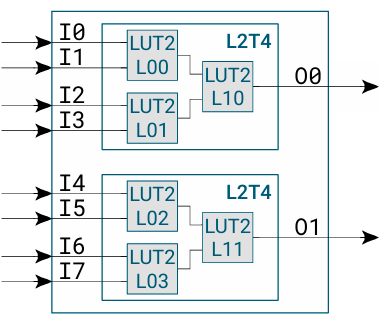
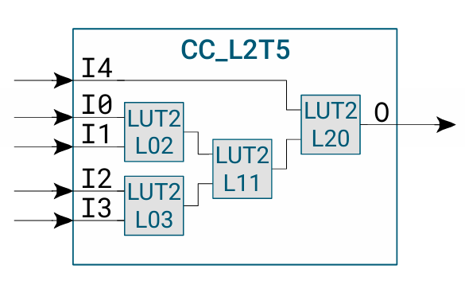

This section is about assessing realistic utilization and performance (Fmax) of the Cologne Chip GateMateA1 FPGA, by injecting routing congestion, pushing its clock and power distribution networks to the limit.

## Notable Architectural Features

CologneChip's CCGM1A1 employs a rather unique architecture on the combinatorial logic front. Most notably, the ubiquotous "LUTs" are now with only two inputs, and connected into "LUT Trees" for the wider logic functions. Importantly, since they come with only 4 bits of storage, these LUT2 building blocks don't have an option to be configured into distributed RAM (aka LUTRAM). That leaves the BRAMs and discrete flops as the only recourse for implementation of small memory and small FIFO functions. 

The GateMate routing network is mostly standard, island-based, though still with a few twists.

The primary motivation for this work is to get a first hand feel for how GateMate fares in both typical and extreme workloads, and contrast it the FPGAs in the same nominal capacity tier. The goal is to understand its useability, efficiency, power outlay, as well as the overall pros and cons in comparison to its peers. 

### LUT-tree Logic - L2T4

The unique feature of the CCGM1A1 is its LUT-tree logic element for combinatorial logic. Rather than using full LUTs, the design splits them into a tree structure, as illustrated in the figure below. CPE (Cologne Programmable Element) consists of two L2T4 LUT trees instead of standard LUT4, LUT5 or LUT6 building blocks.

There's a trade-off here between using an L2T4 and a LUT4:
- **Less area consumed:** A single L2T4 requires only 12 configuration bits compared to 16 for a LUT4.
- **Reduced combinatorial versatility:** An L2T4 can implement **4,096** different 4-input logic functions, whereas a LUT4 can implement **65,536** (these results are obtained using basic combinatorics).

    

The two parallel LUT2s generate only 2 bits of intermediate data, which the final LUT2 uses to compute the output. This bottleneck discards critical relationships between the original four inputs. As a consequence, non-decomposable functions can't be implemented in LUT-trees, like:
- **Arbitrary 4-input AND/OR with mixed terms:**
  
  `F(A, B, C, D) = (A∧B) ∨ (C∧D) ∨ (A∧C)`

  This requires cross-coupling between all four inputs, which the parallel LUT2s cannot capture.

- **Complex conditionals:**
  
  `F(A, B, C, D) = (A⊕B) ? (C∨D) : (C∧D)`

  The conditional logic (`A⊕B`) must influence how `C` and `D` are combined, but the rigid partitioning of inputs breaks this dependency.

Due to this structure, there's also a more strict and constricted routing, particularly, when routing  
**Asymmetric Functions**
   - Functions where the output depends **unevenly** on specific inputs (e.g.,  
     `F(A, B, C, D) = A∧B∧(C∨D)`) may fail if the critical inputs (`A` and `B`)  
     are split across the two initial LUT2s.

Laid out hints to a potential cripple in the FPGA's ability to implement all logic. Luckily, for common operations such as addition, multiplication, basic logic functions and multiplexing this choice holds fine. Now, this makes a 20480 CPE CCGM1A1 have a total of 40960 L2T4 ("LUT4" replacements), making it a kind of a **quasi-41k LUT4** FPGA. Overall effect on logic capacity is assessed in the benchmark tests.

### L2T5 - an improvement

Alleviating the imposed limits of L2T4 an L2T5 primitive is formed. With the cost of using up the whole CPE, L2T5 makes up for some of the logic functions that would instead have to occupy more CPEs. But, be careful, this is not a 1 to 1 replacement with a LUT4, let's take a deeper look into it.

  

###  **Inputs**: 5 (A, B, C, D + one reused input).
### **Key Improvements**
1. **Shannon Decomposition**:
   - Splits functions using a variable (e.g., decompose on `D`):  
     `F = (¬D ∧ F_{D=0}) ∨ (D ∧ F_{D=1})`.
   - Sub-functions:
     - `F_{D=0} = (A ∧ B) ∨ (A ∧ C)` (requires 3-input interaction).
     - `F_{D=1} = (A ∧ B) ∨ C` (pairwise operations).
2. **Dynamic Merging**:
   - Final LUT2 merges sub-functions using all 16 two-input operations (AND, OR, XOR, etc.).
3. **Configuration Scale**:  
   Total configurations: \(4096 x 64 = 262144\) (**64× increase** over L2T4).

### **Achievable Functions**
- **4-input XOR**: `A ⊕ B ⊕ C ⊕ D` (via decomposition and XOR merging).
- **Complex cascades**: `(A ∨ B) ∧ (C ∨ D)` with variable selection.

### **Still Unachievable**
- **3-input core logic**:  
  - `F(A, B, C, D) = (A ∧ B) ∨ (C ∧ D) ∨ (A ∧ C)` (requires simultaneous `A, B, C` interaction).
  - `MAJ(A, B, C, D)` (4-input majority).

---

### **1. Detailed Comparison**
| **Feature**            | **L2T4**                                  | **L2T5**                                   |
|-------------------------|-------------------------------------------|--------------------------------------------|
| **Topology**            | Fixed pairwise processing                 | Adds variable-driven decomposition         |
| **Configurations**      | 4,096                                     | 262,144 (**64× increase**)                 |
| **Function Coverage**   | ~6% of 4-input functions                  | ~20% of 4-input functions                  |
| **Example Achievable**  | `(A ∧ B) ∨ (C ∧ D)`                      | `A ⊕ B ⊕ C ⊕ D`                           |
| **Example Unachievable**| `(A ∧ B) ∨ (C ∧ D) ∨ (A ∧ C)`            | `MAJ(A, B, C, D)`                         |

---

### **2. Why Universality Fails**
### **Core Limitation**
- **L2T4’s Pairwise Bottleneck**:  
  Cannot compute sub-functions requiring **3-input interactions** (e.g., `F_{D=0} = (A ∧ B) ∨ (A ∧ C)`).
- **Hierarchical Constraint**:  
  Final LUT2 in L2T5 merges only two signals (original output + decomposition variable), missing 3-input dependencies.

## 8-input logic -- experimental

Furthermore, combining the two independent L2T4 blocks with one more LUT2, we get an 8-input LUT tree, for a total number of 12+12+4=28 configuration bits bringing the possibility of implementing 40962 logic functions. It's no good for real, 8-input independent variable logic functions, considering the cons of not being able to realize non-decomposable functions, which amplify in this case.

This feature is still experimental, as the synthesis and PnR tools are not yet suited to accomodate this primitive, as discussed [here](https://github.com/chili-chips-ba/openCologne/issues/28).

## Routing Network Architecture

The FPGA features a standard island-style network architecture, consisting of big and small switch boxes that implement 6 and 2 unidirectional ports, respectively, on each of its NWSE sides. In addition to these Manhattan-style interconnects, diagonal connections are provided to allow signals to traverse several rows and columns more quickly—a useful feature for control logic. It is also worth mentioning that the CPE's input and output muxes supplement this routing network.

## Benchmarks

To unveil the real potential of the CologneChip GateMate A1 FPGA, we ran several benchmark tests targeting different aspects of its performance—often comparing it to similarly sized FPGAs from established vendors. Below is an overview of these benchmarks along with a brief description of their strategies. For detailed instructions and result analysis, please refer to the individual subfolders:

- [Corescore](https://corescore.store) — A popular FPGA benchmark that fits as many [Serv](https://github.com/olofk/serv) cores as possible.
- [LUTRAM_Stress_test](https://github.com/tarik-ibrahimovic/LUTRAM_Stress_Test) — Evaluates the capacity of the emulated distributed asynchronous read RAM, a suspected weak spot.
     - [LUTRAM_adjusted_stress_test](https://github.com/tarik-ibrahimovic/LUTRAM_Stress_Test) — A workaround for occuring issues, digging for most credible results
- [VeerWolves](https://github.com/chipsalliance/VeeRwolf/tree/veerwolves) — Similar in concept to Corescore, but with the added challenge of an expanding SOC. Also see [this LI post](https://www.linkedin.com/posts/gsteiert_wearealtera-activity-7240773845098323970-Bvlj?utm_source=share&utm_medium=member_desktop)
- [fpga_torture](https://github.com/stnolting/fpga_torture) — A combined power and utilization stress test.

## The takeaway and key insights
Testing so far has uncovered 2 important hypoteses:
  1. Lut-trees are not as potent as traditional LUTs, and the area-potency tradeoff is on the limit of paying off, especially when you count in the missing features of Lut-trees. 
  2. Short, local routing is handled really well (**up to 97.8% utilization**), but global routing is least to say a challenge
  3. The number of DFFs seems to be oversized for this number of logic elements

Points 1. and 2. are clear from the first 5 tests. Fine-grained locally contained RTL structures achieved high utilization, without any routing issues. On the other hand, when dealing with the coarse, globally distributed structures like LUTRAM, CCGM1A1 struggled with routing. This may be due to a lack of global routing resources, or defficiencies in the PnR tools. 

The CPEs consisting of two L2T4 make this a quasi-41k LUT4 device, but the logic capacity is in reality around 24k LUT4s, using popular FPGA vendors (Intel, Lattice, Gowin) as reference. In conclusion, logic defficiency of LUT-trees degrades the device logic capacity, for most applications, providing a logic capacity of 24k LUT4s, at 28% more configuration bits. The most prominent features of the CCGM1A1 are its abundant DFFs relative to its equivalent logic capacity and the generous amount of BRAM provided. Important to have in mind is the **absolute maximum frequency of CCGM1A1 of 137 MHz** obtained [here](https://github.com/chili-chips-ba/openCologne/tree/main/8.StressTest/5.fpga_torture).

## Additional Tests:
- https://github.com/mirekez/pnr_tests (this is a generic Verilog generator. By playing with parameters, different parts of design can be converted to RAM/SRL/DSP blocks. It also generates XDC to randomly assign pins, which is an auxiliary functionality tied to Xilinx. Dialects for other vendors can also be created).
- https://aignacio.com/posts/hdls/mpsoc_riscv - How to fit 100x RISC-V cores into an FPGA, using a NOC
- https://gitlab.com/x653/spaceinvaders-fpga - While this is not a targeted stress test, it is still an interesting real-life design to reproduce if time allows, see [this](https://olimex.wordpress.com/2025/01/08/space-inavders-retrogame-runs-on-gatematea1-evb)...

## References:
- [Michael Gude talk on GateMate architecture](https://underline.io/lecture/34046-novel-architecture-for-european-fpga)
- [Why GateMate?!](https://pythonlinks.info/presentations/vectors/WhyGateMate.pdf)
- [Project Peppercorn - GateMate bitstream documentation](https://github.com/YosysHQ/prjpeppercorn)
- [nextpnr-gatemate](https://github.com/YosysHQ/nextpnr/tree/gatemate)

  
### End of Document
