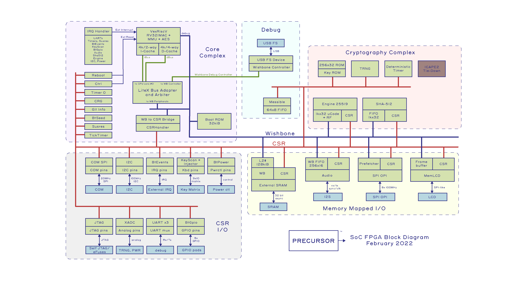

# betrusted.io SoC

This is the core secure-domain SoC for Betrusted.

Compiled documentation: https://ci.betrusted.io/betrusted-soc/doc/[latest register set], https://ci.betrusted.io/betrusted-soc/rustdoc/betrusted_pac/[latest Rust API] documentation.



## Building ##

1. Check out this repo with `git clone --recurse-submodules <repo>`.
1. Ensure you have Python 3.5 or newer installed.
1. Ensure the following python packages are available in your environment: `pycryptodome` (signing - PEM read), `cryptography` (signind - x509 read), `pynacl` (signing - ed25519 signatures), `progressbar2` (updates), `pyusb` (updates).
1. Ensure the `riscv32imac-unknown-none-elf` Rust target is installed via `rustup target add riscv32imac-unknown-none-elf`.
1. Ensure you have `make` installed.
1. Download the Risc-V toolchain from https://github.com/xpack-dev-tools/riscv-none-elf-gcc-xpack/releases and put it in your PATH. The bootloader is pure Rust, except for a few assembly instructions to set up the runtime environment (which are easily verified with a hexdump). However, the full toolchain is still required for LiteX to run correctly.
1. Go to https://www.xilinx.com/support/download.html and download `All OS installer Single-File Download`. Our CI system uses version 2019.2, but it has also been tested against 2020.2. The hashes of the binaries used to build the release SoC can be found in https://github.com/betrusted-io/betrusted-soc/blob/main/manifest.txt[manifest.txt]. Note that this toolchain has been patched for log4j via https://support.xilinx.com/s/article/76957?language=en_US[Xilinx KB76957], patch log https://github.com/betrusted-io/betrusted-soc/blob/main/log4j_patch.log[log4j_patch.log].
1. Do a minimal Xilinx install to /opt/Xilinx/, and untick everything except `Design Tools / Vivado Design Suite / Vivado` and `Devices / Production Devices / 7 Series`
1. Go to https://www.xilinx.com/member/forms/license-form.html, get a license, and place it in ~/.Xilinx/Xilinx.lic
1. Run `./betrusted_soc.py` (or `python3 ./betrusted-soc.py`)

There's a lot of options for betrusted_soc.py. The exact command line used to build a Betrusted SoC that is
compatible with Xous v0.9.9 as of July 2022 is:

`./betrusted_soc.py -e dummy.nky`

The script will expect a file called `keystore.bin` to exist in the same directory. This is the initial
keystore, documented at https://github.com/betrusted-io/betrusted-wiki/wiki/Secure-Boot-and-KEYROM-Layout.
For brand new, "blank" devices with an all-0's key, only the developer public key is necessary for boot.

Explanation:
* `-e dummy.nky` forces the creation of an encrypted image using the all-0's key.
This means we are always using the decryption pathway to configure an FPGA, even if
we don't want to burn a key into the device.

Legacy notes:
* `-u spinal` selects the spinal USB PHY. You want this, so you can do firmware updates and can use USB HID.
* `-x` selects the Xous boot configuration
* `-s NoTimingRelaxation` forces the compiler to exactly meet timing constraints. You can
probably drop this for a faster compilation time, but we prefer to leave it in for our sanity's sake
* `-r pvt2` selects the PVT2 version of the hardware. This is the version shipped to CrowdSupply backers
* `-p` selects physical UART connectivity (as opposed to routing UARTs over wishbone). Physical UARTs
are currently much faster than wishbone UARTs, although less convenient to use as it requires the debug cable
to be attached. You can drop this flag and use `wishbone-tool` to do UART debugging over USB, but because
we are using one USB packet per character, effective baud rate is the *packet rate* of USB, which is maybe
a couple hundred characters per second at best, and dozens of characters per second on some OSes.

## Updating ##

To update the repo to the upstream version, including all dependencies, run:

```sh
git pull
git submodule update --recursive
```

## Using lxbuildenv.py Environment ##

`lxbuildenv` is a Python module.  It sets up the build environment and ensures you have the correct dependencies.  To use it, start your program off with:

```python
#!/usr/bin/env python3
import lxbuildenv
```

*`lxbuildenv.py` has some very surprising behaviors* that you should be aware of:

1. In order to set environment variables such as `PYTHONHASHSEED`, `lxbuildenv` will actually re-exec the Python interpreter.  This will, among other things, cause the pid to change.  *This is why lxbuildenv should be imported first*.
1. The environment variable `PYTHONPATH` is replaced to include every directory under `deps/`.  If you rely on `PYTHONPATH` to be something else, this may surprise you.
1. `lxbuildenv` has several command line parameters that it can accept.  To display these, run your command with the `--lx-help` parameter.
1. The `deps/` directory includes its own `site.py` implementation, adapted from a Debian implementation.  This is because some distros force `/usr/share/python/site-packages/` to be first in the dependency list, which causes confusing dependency interactions.  If you're relying on site packages being in a certain order, this may cause problems.  You can try deleting `deps/site/` in order to disable this behavior.

In exchange for some deviation from other build environments, `lxbuildenv` gives you several benefits that come in handy for hardware projects:

1. Python dicts enumerate in constant order, giving some consistency to build results.
1. You will probably be modifying code in the dependencies.  By keeping them inside the project directory, this becomes much simpler.
1. Additionally, all dependencies remain under version control, which you would otherwise lose when installing dependencies as packages.
1. Hardware, moreso than software, depends on exact version numbers.  By using `git` to track dependency versions, this build becomes more reproducible.
1. It is cross-platform, and works anywhere Xilinx does.
1. The `lxbuildenv` environment doesn't rely on opaque environment variables, or otherwise have a special environment you enter.  Everything is documented behind `--help` flags.

## Working with Dependencies ##

Dependencies are managed through `git`, and managing their usage is largely an exercise
in working with `git`.

For example, if you would like to make a change to `litex`, go into `deps/litex` and checkout
a new branch and create a new upstream repo.  If you're working on Github, you would do
something like fork the repo to your own organization.

As an example, assume `sutajiokousagi` has forked upstream `litex`:

```sh
$ cd deps/litex
$ git checkout -b new-feature
$ git remote add kosagi git@github.com:sutajiokousagi/litex.git
$ cd -
```

Then, make changes to `deps/litex` as needed.

When you want to merge changes upstream, go into `deps/litex/` and push the branch to your remote:

```sh
$ cd deps/litex
$ git push kosagi new-feature
$ cd -
```

Then you can go and open a Pull Request on Github.

## Fetching Updates ##

Dependencies are designed to be independent, and you should update them as needed.  To update a particular
dependency, go into that dependency's subdirectory and run `git pull`.  You may also find it easier to
pull updates from a particular dependency and merge them.  For example, if you're working on the `new-feature`
branch of `litex` and want to pull changes from upstream, run:

```sh
$ cd deps/litex
$ git fetch origin
$ git merge master
$ cd -
```

This will merge all changes from upstream onto your own branch.

## Support programs ##

There is a wrapper script in this repo to run support programs such as `litex_server` and `litex_term`.  These may be invoked either with python (`python bin/litex_server udp`) or on shebang-aware systems they may be executed directly (`./bin/litex_server udp`).

## Xilinx PATH ##

If your Xilinx install is in the default path (`C:\\Xilinx` on Windows, `/opt/Xilinx` on Linux), then the build system should be able to automatically find Xilinx.

If not, you can add the Xilinx `bin` directory to your PATH.

## PyCharm integration ##

To use PyCharm, open this directory as a `Project` by going to the *File* menu and selecting *Open...*.  Make sure you open the entire directory, and not just a single file in this directory.

When you first open this project, you'll see lots of red squiggly lines indicating errors.  PyCharm needs to know about the dependency structure in order to allow you to drill down into modules and auto-complete statements.

Open this directory in PyCharm and expand the `deps/` directory.  Then hold down `Shift` and select all subdirectories under `deps/`.  This will include `litedram`, `liteeth`, and so on.

Then, right-click and select `Mark directory as...` and select `Sources Root`.  The red squiggly lines should go away, and PyCharm should now be configured.

When running your module from within PyCharm, you may find it useful to set environment variables.  You can use the `--lx-print-env` command.  For example: `./betrusted_soc.py --lx-print-env > pycharm.env` to create a `.env`-compatible file.  There are several PyCharm plugins that can make use of this file.

## Visual Studio Code integration ##

Visual Studio Code needs to know where modules are.  These are specified in environment variables, which are automatically read from a .env file in your project root.  Create this file to enable `pylint` and debugging in Visual Studio Code:

```sh
$ python ./betrusted_soc.py --lx-print-env > .env
```

The analyzer will also need to know where your imports are. This would involve editing your `settings.json` file and adding a record that looks a bit like this:
```json
    "python.analysis.extraPaths": ["C:\\PATH-TO-PROJECT\\betrusted-soc\\deps\\litex", "C:\\PATH-TO-PROJECT\\betrusted-soc\\deps\\migen", "C:\\PATH-TO-PROJECT\\betrusted-soc\\deps\\gateware", "C:\\PATH-TO-PROJECT\\betrusted-soc\\deps\\valentyusb"]
```

## Contribution Guidelines

image::https://img.shields.io/badge/Contributor%20Covenant-v2.0%20adopted-ff69b4.svg[Contributor Covenant]

Please see link:CONTRIBUTING.md/[CONTRIBUTING] for details on
how to make a contribution.

Please note that this project is released with a
link:CODE_OF_CONDUCT.md/[Contributor Code of Conduct].
By participating in this project you agree to abide its terms.

## License

Copyright © 2019 - 2022

Licensed under the https://ohwr.org/project/licenses/wikis/cern-ohl-v1.2[CERN OHL v1.2] link:LICENSE[LICENSE]
