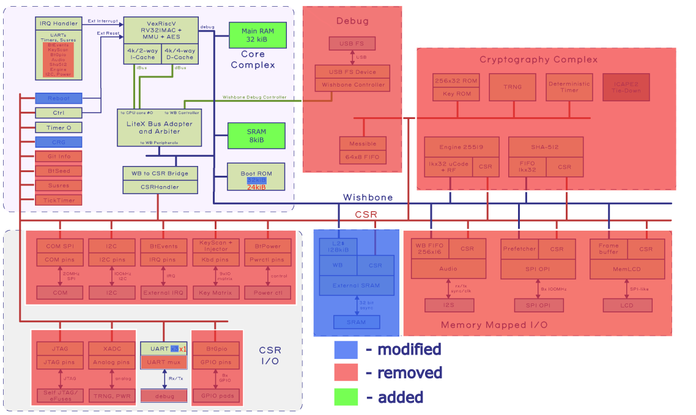

# Betrusted SOC

The [Betrusted](https://github.com/betrusted-io/betrusted-soc) SoC is a LiteX-based, secure, privacy-focused system-on-chip built around the VexRiscv core, originally designed to run on Xilinx Spartan FPGAs for the [Precursor](https://www.crowdsupply.com/sutajio-kosagi/precursor) mobile device. The complete SoC integrates various peripherals such as external SRAM, SPI flash, audio, timers, TRNGs, and cryptographic cores. It also relies on features such as bitstream encryption, false path constraints for timing closure, and other capabilities specific to the Xilinx propriatary toolchain.

 It's worth noting that BetrustedSOC is hosted in a Spartan7 (XC7S50), which is a 50K LUT6 device, 80% utilized as of October 2022, meaning the complete design is severly oversized for our 20k LUT GateMate. On top of that some of these features are **not available** on the Olimex GateMate platform. Therefore, for this project, we are targeting a **minimal port** of Betrusted SoC that includes only the **VexRiscv CPU** (Betrusted version) and **UART** peripheral. This simplified version is intended to serve as a prototype for future work on larger GateMate-based designs (e.g., with 40K or 80K LUT devices).

 This repository covers every step of porting and building the minimal betrusted-soc on GateMate, being **the first openCologne package to cover the new peppercorn PnR for Gatemate**
<!-- Within this work package, we also plan to create a comprehensive blog that describes all FPGA/RTL developed for the project. -->
---

## Prerequisites
Please refer to the [betrusted-soc repository](https://github.com/betrusted-io/betrusted-soc) for a complete list of prerequisites. The project supports building with both the proprietary [GateMate](https://www.colognechip.com/programmable-logic/gatemate/#tab-313425) toolchain and the open-source [nextpnr](https://www.colognechip.com/programmable-logic/gatemate/#tab-313425) flow. We strongly recommend using the **nextpnr** toolchain, as the latest proprietary release (June 2025) currently fails to route the design. The easiest way to install nextpnr is via the **oss-cad-suite** prebuilt binaries. As of July 2025, building it from source is not well documented.

9.BetrustedSOC has dependencies integrated as submodules, to intialize them run:
```bash
cd ../ #cd to openCologne/
git submodule update --init --recursive
```

For building the 9.BetrustedSOC it’s recommended to use an **isolated Python environment** (e.g., via `venv`) to avoid conflicts with global or newer tool versions, as this project depends on specific versions of LiteX and related tools. 

If you decide to use an isolated Python environment after activating it you have to install litex locally:
```
cd deps/litex/
./litex_setup.py --init --install --config=standard
```

---

## Porting to GateMate
Here we list intricaties of the porting process in detail, explaining common pitfalls with litex and what to look out for. Full code listings are omitted; readers are expected to deduce the intended context and functionality from the provided snippets.

The graphic below shows all that's been added, removed or modified to fit BetrustedSOC into Gatemate (at least it's minimal version). Important to point out is that the external SRAM is replaced by internal SRAM and Main RAM. 

> **Resource usage after porting: 48% of CPEs, 93% of Block RAMs, and only 8% of DFFs.**



### IO and Platform
Accessing I/O is straightforward, as the Olimex board is already supported in `/deps/litex_boards/platforms/olimex_gatemate_a1_evb.py`. You can simply import this file as a Python module to gain access to the programmer and the full list of I/Os—similar to Vivado board files. In our case, we defined the I/Os manually in `betrusted_soc.py`, along with the programmer definition inside the platform class, following the approach used in the original Betrusted SoC.

Platform sets the default toolchain to `peppercorn` with the other option of `colognechip`.
### CRG (Clock and Reset Generation)
LiteX abstracts much of the clock and reset generation logic, but you may still want finer control. The original `betrusted-soc` defines seven internal clock domains—some always-on, others gated for power savings when idle. In our case, we simplify this by using only one domain, sourced from a PLL.

The reset logic is defined as `!pll_lock & arst_n`, where `arst_n` is an external asynchronous reset input (e.g., a push-button). This signal is then synchronized into the PLL's system clock domain using `AsyncResetSynchronizer`.

At this point, it's important to understand a key behavior of LiteX. When calling `pll.create_clkout`, LiteX automatically generates a reset signal for the associated clock domain unless explicitly disabled using `with_reset=False`. If left at the default setting, the generated reset will be `!pll_lock`. Attempting to assign your own reset signal in that case will lead to multiple drivers for the same `reset` signal—an error.

Because all logic tied to a given clock domain shares its reset, it's crucial to understand and control this mechanism properly. For a deeper discussion and practical tips on CRG (Clock and Reset Generation) in LiteX, refer to this [issue thread](https://github.com/enjoy-digital/litex/issues/1805).

### SoC definition
LiteX comes with many default behaviors that can be surprising. In this section, we highlight some that were particularly relevant during the porting process.

LiteX includes a lightweight BIOS, which is automatically built when `builder.build()` is called and initialized in memory. To use the LiteX BIOS, you must define a memory region named exactly `ROM` (minimum 25 kB) and another named `SRAM` (minimum 8 kB). The benefit of using the BIOS—despite the memory overhead—is that it enables easy reloading of application binaries over a serial connection at runtime, without needing to rebuild the SoC to reinitialize memory.

So, where does the actual application binary go? It is loaded into a memory region named exactly `main_ram`, which must be explicitly defined (e.g., as a 32 kB region). The memory region names `rom`, `sram`, and `main_ram` have special meaning in LiteX: even if you override their addresses using `soc.mem_map['rom'] = 0x...`, they will be overwritten with the following defaults defined in `regions.ld`, which is used when linking the application:

```python
'rom':       0x00000000
'sram':      0x10000000
'main_ram':  0x40000000
```

The Betrusted SoC overrides this behavior by reassigning the memory regions after the SoC constructor, if they were overwritten. In our case, we leave the defaults unchanged.

We're already near the memory limits of the GateMate FPGA (30 out of 32 Block RAMs used—the remaining ones consumed by VexRiscv instruction/data caches and UART FIFOs). The Betrusted SoC assumes external SRAM is available, but that’s not the case here. This makes us memory-constrained unless we remove the LiteX BIOS. Besides optimizing software or using clever DMA strategies, there isn’t much room left for expansion.

**Resource usage after porting: 48% of CPEs, 93% of Block RAMs, and only 8% of DFFs.**


---
## Notes on the Hardware Build Process
### Building
To build the hardware and the bios simply run:
```bash
python3 betrusted_soc.py --toolchain=[peppercorn(default), colognechip] > build.log 2>&1
```
Latest Colognechip toolchain(June 2025) fails in routing, a temporary fix is to use previous [versions](https://github.com/chili-chips-ba/openCologne/issues/70), or just stick to peppercorn. **Nextpnr unlike colognechip is timing driven, you can set timing constraints such as false paths.**

### Maximum frequency and nextpnr seeds
`Colognechip`(January 2025) routes to a Fmax of 19 MHz (-tm 3 [proven](https://github.com/chili-chips-ba/openCologne/issues/62)).

Nextpnr is a more complicated story, we've raised an [issue](https://github.com/chili-chips-ba/openCologne/issues/73) explaining it's unpredictable behavior regarding Fmax. However, we've reliably got the design running @ 25 MHz with the nextpnr toolchain.

---


## Notes on Software Build Process
### Building 
LiteX provides C header files that expose access to the SoC's CSRs and peripherals. Applications—whether bare-metal or OS-based—are expected to be built on top of this framework and compiled independently using a Makefile or similar build system.

A great starting point for setting up a bare-metal application is the `litex_bare_metal_demo` utility. Running:

```bash
litex_bare_metal_demo --build-path=./build
```

will generate a `demo/` directory containing all necessary source files. After making changes to the code, simply run `make` inside the `demo/` directory to build a new `demo.bin` binary, which can be reloaded onto the running SoC as explained below.

To compile and run this demo on the `betrusted-soc`, first build the hardware, then execute:

```bash
litex_bare_metal_demo --build-path=./build
litex_term /dev/ttyACM0 --kernel=demo.bin --safe
```

If everything is set up correctly, you’ll see the signature LiteX boot output. If not, press the `reset` button on your board to restart the SoC. For more details on the demo, refer to the [LiteX software demo documentation](https://github.com/enjoy-digital/litex/tree/master/litex/soc/software/demo).

---

## Current Status

* [x] Strip down Betrusted SoC to VexRiscv(Betrusted version) and UART
* [x] Update and adapt LiteX build system for GateMate
* [x] Build and run a simple bare-metal test application
* [x] Simulate and validate the hardware build
* [x] Enable boot-time UART binary loading using LiteX BIOS

<!-- **EXTRA**: Incrementally reintroduce additional Betrusted SoC peripherals and features -->

---
## References

* [betrusted-io/betrusted-soc](https://github.com/betrusted-io/betrusted-soc)

#### End of Document 
