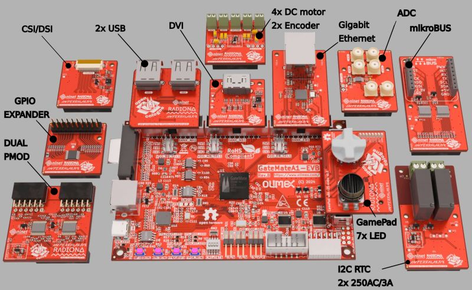

Currently there are few FGPA vendors in Europe. One of these vendors, CologneChip. Their GateMate device has a somewhat unique feature set for the 20K class, most notably the high-speed SerDes. It is also one of the rare families designed around 2-input [LUT trees and muxes](https://github.com/chili-chips-ba/openCologne/issues/28#issue-2442939220), vs. the mainstream microRAM-based LUTs with 4, 5 or 6 address inputs. 

   

Given recent appearances of affordable boards, GateMate challenge at the moment is to get hold of, and grow roots in the open hardware dev community... which is also an opportunity. We are firmly set to help GateMate achieve this goal. 

How? By pursuing a three-pronged approach:

1) Design the third flavor of the popular open hardware ULX3S->ULX4M sequel ->>> The **ULX5M**! While LatticeSemi FPGA will on this new board be replaced with GateMate, it will otherwise come in the same popular Raspberry Pi Compute Module 4 (CM4) form-factor. That makes it plug-and-play compatible with a vast asssortment of baseboards, so opening the first and only EU FPGA to a commendable set of existing peripherals and apps.

2) Create and validate a portfolio of **well-documented examples** that put GateMate resources to good use. Be it by tapping into SystemVerilog or VHDL RTL, HLS design methodologies, demonstrating pure hardware FSM implementations, or HW/SW co-design, utilizing SOC techniques, or possibly even reaching into Amaranth and LiteX build frameworks... the goal is to expand GateMate audience, faciliate silicon adoption, and ultimately have it gain a foothold in the market.

3) Engage with [CologneChip](https://www.colognechip.com/programmable-logic/gatemate) staff to resolve [issues](https://github.com/chili-chips-ba/openCologne/issues) identified in this course.

The practical execution of this strategy is organized into 3 game levels with 9 play milestones.

## *Level I – Warm Up*

**Play 1** - Form development team and get to know CologneChip GateMate silicon and dev tools, see our [0.doc](https://github.com/chili-chips-ba/openCologne/tree/main/0.doc) folder. Procure [Olimex](https://www.olimex.com/Products/FPGA/GateMate/GateMateA1-EVB/open-source-hardware) boards and familiarize with hardware platform. Light up onboard LEDs with our very special [blinky](https://github.com/chili-chips-ba/openCologne/tree/main/1.Blinky--Verilog-VHDL-Python.Amaranth/3.build). It contains _Verilog_, _VHDL_ and _Amaranth_ versions, as well as an example of how to use **CologneChip Internal Logic Analyzer (ILA)** for Olimex board. The **Makefile** and **CCF** in there are your essential _Getting Started Guide_, and golden reference to leverage from for your project.

**Play 2** - Port to GateMate a selected subset of simpler examples from the [ULX3S-MISC](https://github.com/emard/ulx3s-misc/tree/master/examples) portfolio. The goal is to enable a few standard PMODs and peripherals, mostly GPIO-based, including PSRAM/HyperRAM.

**Play 3** - To complement the set of peripherals that GateMate can be tested with, as well as design additional PMOD extensions for it.

## *Level II - Bread and Butter*

**Play 4** - Port to GateMate a couple of advanced ULX3S examples. Now without restrictions related to PCB development support, we are choosing these examples for their purely FPGA value. We may also modify them, write mutations and variants, looking to find a better fit for GateMate internal architecture, or letting creativity a free hand to play and experiment.

**Play 5** - Adapt [TetriSaraj](https://github.com/chili-chips-ba/openXC7-TetriSaraj) HW/SW project to GateMate. This is a serious SOC. Its hardware includes a RISC-V microkontroller, Instruction, and Data RAM, Frame Buffer with Video Subsystem, and high-speed I/O for VGA. On the software side, this is a bare-metal, "free-standing" C that implements the logic of a Tetrisoid gate.

**Play 6** - Design and manufacture the ULX5M board.

## *Level III - Candy Cane*

**Play 7** - Develop an advanced example for CologneChip SerDes and its high-speed PLL.

**Play 8** - Stress-test the FPGA device and tools, such as to assess silicon Fmax and realistic utilization, injecting routing congestion and pushing the clock distribution network to its limits. 

**Play 9** - Port the barebones of [BetrustedSOC](https://github.com/betrusted-io/betrusted-soc) to GateMate, namely its VexRiscv CPU and UART.

This is a stepping stone for our next CologneChip project, perhaps using one of their yet to be released 40K or 80K devices. 

For background, BetrustedSOC is currently hosted in a Spartan7 XC7S50 (50K LUT6 device), with 80% utilization (as of October 2022), implemented using proprietary Vivado 2019.2 toolchain, also enjoying a 5K LUT4 Lattice UP5 FPGA on the side for housekeeping tasks. The full BetrustedSOC would indeed be fun to eventually port to GateMate!

## Project Completion Matrix

- [x] Level I, Play 1 - **DONE, includes bonus examples**
>- [x] 1.Blinky--ILA-Test
>- [x] 1.Blinky--Verilog-VHDL-Python.Amaranth

- [x] Level I, Play 2 - **DONE, with bonus examples**
>- [x] 2.Simple--1--PSRAM
>- [ ] 2.Simple--2--QSPI-Flash, done outside of this project
>- [ ] 2.Simple--3--Ethernet, done outside of this project
>- [x] 2.Simple--4--1Wire-Controller
>- [x] 2.Simple--5--UART-Test
>- [x] 2.Simple--6--PS2-Keyboard
>- [x] 2.Simple--7--Audio-4-bit-DAC

- [x] Level I, Play 3
> - [x] **PCB repo1**: Design additional [extension boards](https://github.com/intergalaktik/Extension_Boards_for_Olimex_GateMate)

---
- [x] Level II, Play 4 - **DONE**
>- [x] 4.Advanced--1--SPI-LCD
>- [x] 4.Advanced--2--LED64x64
>- [x] 4.Advanced--3--FM-Transmitter
>- [ ] 4.Advanced--4--Yamaha-OPL3-FM-Synth, partly done, abandoned due to issues with tools

- [x] Level II, Play 5 - **DONE**
> - [x] 5.TetriSaraj

- [ ] Level II, Play 6
>- [ ] **PCB repo2**: Design and manufacture the [ULX5M board](https://github.com/intergalaktik/ulx5m-gs)

---
- [ ] Level III, Play 7 - WIP
> - [ ] 7.SerDes

- [x] Level III, Play 8 - **DONE**
> - [x] 8.StressTest

- [ ] Level III, Play 9 - WIP
> - [ ] 9.BetrustedSOC

---
- [ ] Bonus#1, Play 10, even more examples
> - [ ] 10.Bonus--1--Amaranth-7Segment, WIP
> - [ ] 10.Bonus--2--Amaranth-Rotary-Encoder, WIP
> - [ ] 10.Bonus--3--Amaranth-eduRISC5
> - [x] 10.Bonus--4--I2C-Master
> - [ ] 10.Bonus--5--eduSOC, moved to 8.StressTest
> - [x] 10.Bonus--6--I2S-DAC

We fell in love with what we were doing and, as makers at heart, could not resist the temptation to keep designing for GateMate. Hence this additional output that was not originally planned for, nor commissioned by NLnet.

---
Please click on the folder with individual examples for additional detail, documenation and specific instructions.

## Bonus#2 (from CologneChip direct input/needs)
- Comps with Gowin, Lattice and Xilinx design flows:
    - overall execution speed
    - ease of use
    - straighforwardness (or not) of the work flow
    - completeness of tool suite
    - bugs and idiosyncrasies
    - ideas for enhancement and automation of the development process

- Comps with Gowin, Lattice and Xilinx silicon in the 20K LUT category
    - Fmax
    - utilization metrics
    - practically achievable design sizes in LUTs and FFs, i.e. the overall efficiency of GateMate architecture

- Misc.
    - help prepare demos and marketing material for trade shows
  
While doing our best to fulfill these special requests that are outside the NLnet task list, we'd better plan for a follow up project for other CologneChip needs that are emerging through this work.

For example, we've already established that TetriSaraj (PicoSOC with PicoRV32) can on GateMate barely run at `31MHz` in its high Voltage setting `-om 3, -tm 3`, see this [issue](https://github.com/chili-chips-ba/openCologne/issues/35#issue-2529092332). On the other hand, the lowest speed-grade Artix7 (xc7a35tcpg236-1) had no problem with `100MHz+`. Moreover, this is not even an apples-to-apples comparison since, to make GateMate go over 25MHz (which is the absolute minimum for our VGA video sub-system), we had to strip the PicoSOC down to barebones, i.e. take out its features that were not critical for TetriSaraj. Without that, the original GateMate Fmax for the 100% identical RTL was on the order of `16MHz`.

Similarly, we found that GateMate [timing reporting](https://github.com/chili-chips-ba/openCologne/issues/35#issue-2529092332) was sub-standard, its [constraints-driven](https://github.com/chili-chips-ba/openCologne/issues/38) property questionable, [SystemVerilog](https://github.com/chili-chips-ba/openCologne/issues/3) support not built-in, simulation [models](https://github.com/chili-chips-ba/openCologne/issues/14) and [Verilator](https://github.com/chili-chips-ba/openCologne/issues/8) compatibility lacking. 

Most importantly, the `GateMate proprietary P_R tool has repeatedly proved to be erroneous and unreliable`, see issues https://github.com/chili-chips-ba/openCologne/issues/30 and https://github.com/chili-chips-ba/openCologne/issues/25. For the complete account, please review all discussions and issues we've raised, both open and closed.

> The good news is that, just as our project is uncovering issues, so is CologneChip addressing them... to slowly, step by step, turn GateMate tools and silicon into an FPGA platform that's actually useable in the real-life designs. 

We are proud to have initiated GateMate enablement in opensource [Amaranth](https://github.com/amaranth-lang/amaranth) and [PipelineC](https://github.com/JulianKemmerer/PipelineC) dev frameworks. This project has also introduced GateMate to [Source Code Linting](https://github.com/chipsalliance/verible) for not only style, format, syntax and semantics, but also the [CDC](https://github.com/chili-chips-ba/openCologne/issues/29), a topic that is admittedly insufficiently covered by opensource chip design movement in general.

## A peek into our PCB track

  

   
[Click](https://github.com/intergalaktik/Extension_Boards_for_Olimex_GateMate) for more...

## Beinvolved
We welcome everyone interested to contribute. Please reach out to fpga@chili-chips.com, or join our <a href="https://discord.gg/F5UPDFFdsH">GateMate Discord Channel</a>. 

## Additional References
- https://github.com/PythonLinks/awesome-gatemate
- https://github.com/YosysHQ/prjpeppercorn
- https://colognechip.com/wp-content/uploads/Novel-GateMate-FPGA-Architecture-FPL2021.pdf
  
## Acknowledgements
We are grateful to:
  - **NLnet Foundation's** sponsorship for this opportunity to put our hand and brains on GateMate.
  - **[Intergalaktik doo](https://intergalaktik.eu)** for their unreserved sharing of the first-hand insights into open-source community vibe, participation on the project, and openess to our wish to play a part in the ULX* unabated evolution.

    
    

## Public Postings
- [CologneChip News](https://colognechip.com/news/new-extensions-for-the-olimex-gatemate-fpga-board)
- [IO cards](https://www.linkedin.com/posts/goran-mahovlic_fpga-opensource-openhardware-activity-7272630456599138304-nB8K?utm_source=share&utm_medium=member_desktop)
- [IO cards2](https://www.linkedin.com/posts/goran-mahovlic_fpga-opensource-openhardware-activity-7273353028055769089-qn1x?utm_source=share&utm_medium=member_desktop)
- [TetriSaraj](https://www.linkedin.com/posts/chili-chips_tetrisaraj-gatemate-opensource-activity-7252167674741301249-gOgI?utm_source=share&utm_medium=member_desktop)
- [LED 64x64](https://www.linkedin.com/posts/ahmed-imamovic_etfpga-fpga-rtl-activity-7242253055411331073-E36f?utm_source=share&utm_medium=member_desktop)
- [LCD](https://www.linkedin.com/posts/chili-chips_gatemate-spi-lcd-activity-7233383297500733441-F4PM?utm_source=share&utm_medium=member_desktop)

#### End of Document
